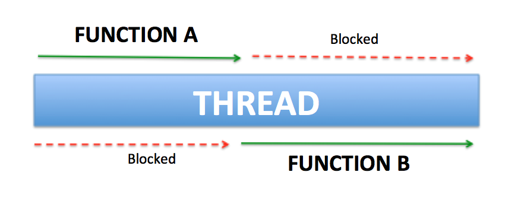
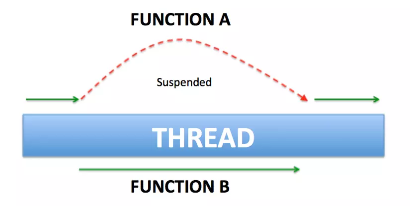

# I. Giới thiệu Kotlin Coroutine và kỹ thuật lập trình bất đồng bộ
```https://viblo.asia/p/cung-hoc-kotlin-coroutine-phan-1-gioi-thieu-kotlin-coroutine-va-ky-thuat-lap-trinh-bat-dong-bo-gGJ59xajlX2```
## 1. Đặt vấn đề
Xưa nay, các dev luôn phải đối mặt với một vấn đề cần giải quyết là làm thế nào để ứng dụng không bị block UI, tắc nghẽn khiến cho user ko thể thao tác tiếp tục được. Thực tế việc này rất dễ xảy ra khi chạy 1 tác vụ nặng trên main thread.

Để giải quyết bài toán trên, các dev buộc phải biết kỹ thuật lập trình bất đồng bộ. Có nhiều cách tiếp cận để giải quyết vấn đề này, bao gồm:

Threading.
Thread + Callbacks/Asynctask/Handler.
Reactive Extensions (Rx).
Coroutines.
Trước khi giải thích Coroutines là gì, hãy xem xét ngắn gọn một số giải pháp khác.

## 2. Một số giải pháp xử lý bất đồng bộ
### 2.1. Threading
Chúng ta sẽ thực thi tác vụ nặng trong 1 thread riêng khác main thread. Đoạn code dưới đây mô tả cách tạo và chạy 1 thread trong Kotlin.
```kotlin
thread(true) {
    executeLongTask()
}

```
Tuy nhiên, sử dụng Thread sẽ có 1 loạt các nhược điểm sau:

* Cái giá phải trả cho 1 thread là khá đắt. Thực tế, lạm dụng thread sẽ làm ảnh hưởng performance. Tham khảo thêm lý do tại đây: Why is creating a Thread said to be expensive?
* Số thread là hữu hạn, không phải vô hạn. Đây cũng là lý do khiến cho giá thread đắt đỏ 😄. Thử tưởng tượng, chúng ta đã sử dụng hết số thread, đến đoạn code nào đó chúng ta cần tạo thêm 1 thread để thực thi thì lấy đâu ra. Khi đó, app sẽ rơi vào trạng thái tắc nghẽn cổ chai (bottleneck).
* Sử dụng Thread không hề dễ. Debug thằng này thì khó thôi rồi. Deadlock, race conditions là những vấn đề phổ biến chúng ta sẽ gặp phải nếu không hiểu rõ về Thread.
* Thử tưởng tượng với đoạn code trên, nếu bạn đang cần callback từ thread đó đến main thread để update UI thì sẽ xử lý thế nào đây ???. Với nhược điểm lớn này, chúng ta sẽ khắc phục bằng cách sử dụng callback kết hợp với thread.

### 2.2. Thread + Callbacks / Async task / Handler
Sử dụng callback trong Kotlin đơn giản như đoạn code dưới đây:
```kotlin
override fun onCreate(savedInstanceState: Bundle?) {
    super.onCreate(savedInstanceState)
    setContentView(R.layout.activity_main)
    thread(true) {
        executeLongTask { taskDone ->
            textViewTaskName.text = taskDone
        }
    }
}

private fun executeLongTask(taskDone: (name: String) -> Unit) {
    taskDone.invoke("Viblo Report")
}

```
Nhìn đoạn code trên quá gọn nhỉ. Thầm nghĩ đây chính là giải pháp tuyệt vời nhất để giải quyết bài toán bất đồng bộ -> update UI rồi 😄. Thế nhưng đoạn code trên sẽ không còn gọn gàng nếu chúng ta buộc phải sử dụng các callback lồng nhau hay nối tiếp nhau. Ví dụ đoạn code yêu cầu đăng ký xong tài khoản -> đăng nhập -> get user detail:
```kotlin
fun register(newUser: User) {
    val username = newUser.getUsername()
    val password = newUser.getPassword()

    api.register(newUser, object : Callback<Boolean>() {
        fun onResponse(success: Boolean) {
            if (success) {
                api.login(AuthData(username, password), object : Callback<Token>() {
                    fun onResponse(token: Token) {
                        api.getUser(token, object : Callback<UserDetail>() {
                            fun onResponse(userDetail: UserDetail) {
                                // cuối cùng cũng đến Tây Thiên, get được userDetail rồi =))
                            }
                        })
                    }
                })
            }
        }
    })
}

```

Asynctask hay Handler khi xử lý lồng nhau cũng sẽ mất thẩm mỹ như vậy. Đó là nhược điểm chung của cả 3 thằng Thread + Callbacks / Asynctask / Handler.

Đợi đã, có vẻ như mình đã làm lố vấn đề bằng đoạn code trên. Thực tế, chúng ta có thể tuân thủ clean code bằng cách tạo function riêng cho từng chức năng cơ mà. Trông nó sẽ gọn hơn như sau:
```kotlin
fun register(newUser: User) {
    val username = newUser.getUsername()
    val password = newUser.getPassword()

    api.register(newUser, { success ->
        if (success) {
            login(username, password)
        }
    })
}

private fun login(username: String, password: String) {
    api.login(AuthData(username, password), { token -> getUserDetail(token) })
}

private fun getUserDetail(token: Token) {
    api.getUser(token, { userDetail ->
        // get được userDetail
    })
}

```
Nhìn cũng không tệ, thế nhưng chúng ta có một thứ có thể giải quyết nó gọn đẹp hơn. Đó là Reactive Extensions mà chúng ta hay gọi là Rx đấy 😄.

### 2.3. Rx
Bài toán trên qua bàn tay của Rx sẽ gọn gàng, đẹp đẽ như sau:
```kotlin
fun register(newUser: User) {
    val username = newUser.getUsername()
    val password = newUser.getPassword()

    api.register(newUser)
        .filter({ success -> success })
        .flatMap({ success -> api.login(AuthData(username, password)) })
        .flatMap({ token -> api.getUser(token) })
        .subscribe({ userDetails ->
            // get được userDetail
        })
}

```

Rx thì hoàn hảo quá rồi. Có nhược điểm gì đâu nhỉ. Thực tế có rất nhiều bài viết so sánh giữa Rx với Kotlin Coroutine. Có người về phe Rx, cũng có người về phe Coroutine. Mọi người có thể search anh Gồ để tìm hiểu thêm sự so sánh này. Nhưng theo quan điểm của mình, Rx là một thư viện lớn và đồ sộ, rất khó học đối với người mới. Thực tế, những bạn mới khi gặp phải những dự án sử dụng Rx thường gặp khó khăn trong vấn đề viết code và đọc hiểu nó trong thời gian đầu. Thôi thì những ai thấy Rx khó xơi như mình thì cùng học Kotlin Coroutine với mình vậy =)).

## 3. Kotlin Coroutine
Ở phần 1 này, mình sẽ không đi sâu vào các hàm, từ khóa của thư viện Kotlin Coroutine mà chỉ phân tích những ưu điểm của nó. Lý do nên xử dụng nó thay vì những thằng trên 😄. Chúng ta sẽ tìm hiểu về các hàm cũng như từ khóa trong Kotlin Coroutine ở Phần 2. Mình xin ví dụ 1 đoạn code sử dụng Kotlin Coroutine.
```kotlin
fun getTokenAndLogin() {
// launch a coroutine
    GlobalScope.launch {
        val token = getToken() // hàm getToken() này được chạy bất đồng bộ
        login(token)           // thế nhưng cách viết code lại giống như đang viết code đồng bộ (code từ trên xuống)
    }
}

suspend fun getToken(): String {
    // makes a request and suspends the coroutine
    return suspendCoroutine {
        // handle and return token
        it.resume("AdfGhhafHfjjryJjrtthhhFbgyhJjrhhBfrhghrjjyGHj")
    }
}

private fun login(token: String) {
    // TODO login with token
}

```

Khoan hãy quan tâm đến đoạn code trên. Mình sẽ giải thích rõ hơn về code ở phần 2 nhé 😄. Dựa vào code này, mình sẽ đưa ra một số ưu điểm của Coroutine khắc phục được các nhược điểm của các thằng trên:

Coroutines về cơ bản có thể hiểu nó như một "light-weight" thread, nhưng nó không phải là 1 thread, chúng chỉ hoạt động tương tự 1 thread. Hàng nghìn coroutines có thể được bắt đầu cùng một lúc, còn nếu hàng nghìn thread chạy thì performance sẽ trả 1 cái giá rất đắt. Tóm lại, giá phải trả cho 1 thread là rất đắt, còn coroutine thì gần như là hàng free. Quá tuyệt vời cho performance 😄
Như đã phân tích ở mục II, việc viết code xử lý bất đồng bộ rất là lộn xộn và khó debug. Còn với Kotlin Coroutine, code được viết như thể chúng ta đang viết code đồng bộ, từ trên xuống, không cần bất kỳ cú pháp đặc biệt nào, ngoài việc sử dụng một hàm gọi là launch. (Hàm này giúp khởi động coroutine và mình sẽ phân tích rõ hơn ở phần 2). Function xử lý task bất đồng bộ được viết giống y như khi ta viết function xử lý task đồng bộ. Sự khác biệt duy nhất là từ khóa suspend được thêm vào trước từ khóa fun. Và chúng ta có thể return bất kỳ kiểu dữ liệu nào chúng ta muốn. Điều mà Thread không làm được mà phải cần tới AsyncTask củ chuối.
Kotlin Coroutine là nền tảng độc lập. Cho dù bạn đang viết code JavaScript hay bất kỳ nền tảng nào khác, cách viết code implement Kotlin Coroutine sẽ đều giống nhau. Trình biên dịch sẽ đảm nhiệm việc điều chỉnh nó cho từng nền tảng.

**Kết luận**

Kết thúc phần 1, hy vọng bạn đã thấy được sự cần thiết của Kotlin Coroutine trong lập trình xử lý bất đồng bộ. Ở những phần tiếp theo, mình sẽ phân tích sâu vào thư viện Kotlin Coroutine và sự kết hợp Coroutine cùng Room và Retrofit. Cảm ơn các bạn vì đã đọc.


# II. Build first Coroutine with Kotlin
## 1. Những điểm cần chú ý ở phần 1
Ở phần 1, chúng ta đã tìm hiểu về định nghĩa về coroutine. Mình xin note lại một vài điểm lưu ý như sau:

* Coroutine giống như light-weight thread. Nhưng nó không phải là thread. Nó giống thread ở chỗ là các coroutine có thể chạy song song, đợi nhau và trao đổi dữ liệu với nhau. Sự khác biệt lớn nhất so với thread là coroutine rất rẻ, gần như là hàng free, chúng ta có thể chạy hàng nghìn coroutine mà gần như không ảnh hưởng lớn đến performance.
* Một thread có thể chạy nhiều coroutine.
* Coroutine không phải lúc nào cũng chạy trên background thread, chúng cũng có thể chạy trên main thread.
## 2. Build first coroutine with Kotlin
Để sử dụng được Kotlin Coroutine, bạn cần thêm 2 dependency sau:
```groovy
implementation 'org.jetbrains.kotlinx:kotlinx-coroutines-core:1.2.1'
implementation 'org.jetbrains.kotlinx:kotlinx-coroutines-android:1.1.1'
```
Một coroutine được cấu tạo gồm các thành phần sau:
```kotlin
GlobalScope.launch { // chạy một coroutine
        delay(10000L) // delay 10s nhưng ko làm blocking app
        println("World,") // print từ World ra sau khi hết delay
    }
    println("Hello,") // main thread vẫn tiếp tục chạy xuống dòng code này trong khi coroutine vẫn đang bị delay 10s
    Thread.sleep(20000L) // block main thread 20s
    println("Kotlin")

```
Đây là output của đoạn code trên:
```
Hello,  // Giả sử Hello, được in ra ở giây thứ 1
World,  // thì từ World, sẽ được in ra ở giây thứ 11
Kotlin  // và từ Kotlin sẽ được in ra ở giây thứ 21
```
* Bloc launch {} là một coroutine builder. Nó phóng một coroutine chạy đồng thời (concurrently) với các phần code còn lại. Đó là lý do từ "Hello" được print ra đầu tiên.

* GlobalScope là coroutine scope. Chúng ta không thể launch một coroutine nếu nó không có scope. Mình sẽ nói về Coroutine Scope trong các bài tiếp theo.

* Hàm delay() nhìn thì có vẻ giống hàm Thread.sleep() nhưng chúng rất khác nhau. Bởi vì hàm delay() là một suspend function, nó sẽ không block thread (non-blocking thread) còn hàm Thread.sleep() thì block thread. Vậy thế nào là non-blocking, thế nào là blocking?. Hàm suspend là hàm gì, nó khác gì với một hàm bình thường?
## 3. Blocking Vs Non-Blocking / Normal function vs suspend function
### 3.1. Blocking
Ví dụ 1 đoạn code sử dụng normal function mà chúng ta vẫn thường code:
```kotlin
fun functionA() { println("in ra A") }
fun functionB() { println("in ra B") }
fun main() {
       // chạy functionA và functionB
       functionA()
       functionB()
}

```
Sau khi ta chạy hàm main thì chuyện gì sẽ xảy ra. Main thread sẽ chạy xong hết functionA rồi mới chạy tiếp functionB. Các dòng lệnh, các hàm được thực hiện một cách tuần tự từ trên xuống dưới. Khi một dòng lệnh ở phía trước chưa được hoàn thành thì các dòng lệnh phía sau sẽ chưa được thực hiện và phải đợi khi mà thao tác phía trước hoàn tất.

Nếu như các dòng lệnh trước là các thao tác cần nhiều thời gian xử lý như liên quan đến IO (Input/Output) hay mạng (Networking) thì bản thân nó sẽ trở thành vật cản trở cho các lệnh xử lý phía sau mặc dù theo logic thì có những việc ở phía sau ta có thể xử lý được luôn mà không cần phải đợi vì chúng không có liên quan gì đến nhau.

Ví dụ như chúng ta cần get tất cả videos trong máy và get thông tin máy.
```kotlin
fun main() {
    getVideos() // Giả sử hàm này chạy mất hết 2 phút
    getInfo() // phải đợi hàm getVideos chạy xong mới được chạy trong khi hàm này chẳng liên quan gì đến getVideos
    updateUiInfo()
}

```
Như vậy người dùng phải chờ ít nhất 2 phút sau thì mới hiển thị được info lên màn hình.

### 3.2. Non-blocking
* Các dòng lệnh không nhất thiết phải lúc nào cũng phải thực hiện một cách tuần tự (sequential) và đồng bộ (synchronous) với nhau.
* Các dòng lệnh phía sau được chạy ngay sau khi dòng lệnh phía trước được gọi mà không cần đợi cho tới khi dòng lệnh phía trước chạy xong.
* Để thực hiện mô hình Non-Blocking, người ta có những cách để thực hiện khác nhau, nhưng về cơ bản vẫn dựa vào việc dùng nhiều Thread (luồng) khác nhau trong cùng một Process (tiến trình), hay thậm chí nhiều Process khác nhau (inter-process communication – IPC) để thực hiện.
Vậy coroutine có thể chạy non-blocking. Non-blocking nhưng không cần phải dựa vào việc dùng nhiều thread. Một thread chạy nhiều coroutine cũng có thể chạy được mô hình non-blocking.

### 3.3. Suspend function
Hình ảnh biểu diễn một thread đang chạy 2 function là functionA và functionB. Chúng ta có thể thấy thread đó phải chạy xong function A rồi mới đến functionB. Đây là cách chạy phổ biến của normal function mà chúng ta vẫn hay code.


Suspend function cho phép ta làm được điều vi diệu hơn. Đó là suspend function có khả năng ngừng hay gián đoạn việc thực thi một lát (trạng thái ngừng là trạng thái suspend) và có thể tiếp tục thực thi lại khi cần thiết. Như hình ảnh dưới đây: functionA bị gián đoạn để functionB chạy và sau khi functionB chạy xong thì function A tiếp tục chạy tiếp.



Một vài lưu ý với suspend function:

* Suspend function được đánh dấu bằng từ từ khóa suspend. VD:
```kotlin
suspend fun sayHello() {
    delay(1000L)
    println("Hello!")
}

```
* Chỉ có thể được gọi suspend function bên trong một suspend function khác hoặc bên trong một coroutine. Ví dụ hàm delay trong đoạn code trên là một suspend function và chỉ được gọi trong hàm suspend function khác là hàm sayHello. Nếu ta xóa từ khóa suspend trong hàm sayHello thì hàm sayHello sẽ không còn là suspend function nữa mà chỉ là một function bình thường. Khi đó hàm delay sẽ bị lỗi compile như sau:
```
Error: Kotlin: Suspend functions are only allowed to be called from a coroutine or another suspend function
```
### 3.4. Run blocking with coroutine
Nếu như ở phần trên, các bạn đã biết coroutine có khả năng chạy mà non-blocking thread. Giả sử, trong trường hợp bạn muốn coroutine chạy blocking thread (chạy tuần tự) thì sao?

Khi đó chúng ta sẽ có block runBlocking { }. Tương tự như block launch { } được dùng ví dụ ở mục 2., bên trong block runBlocking { } cũng là một coroutine được tạo ra và chạy.
```kotlin
runBlocking { // chạy một coroutine
   println("Hello")
   delay(5000)
}
println("World")

```
Output của đoạn code này là:
```
Output: 22:00:20 I/System.out: Hello
        22:00:25 I/System.out: World
```
Nếu để ý ta sẽ thấy từ World được in ra sau từ Hello là 5 giây. Như vậy có nghĩa là main thread đã bị blocking chờ khi xong hàm delay 5s mới chạy xuống đoạn code println("World").

Chúng ta có thể viết lại đoạn code trên theo style code mới:
```kotlin
private fun main() = runBlocking { 
   println("Hello")
   delay(5000)
}

override fun onCreate(savedInstanceState: Bundle?) {
   super.onCreate(savedInstanceState)
   main()
   println("World")
}

```
### 5.5. Coroutines are light-weight thead
Bây giờ mình sẽ chứng minh rằng coroutine nhẹ như thế nào so với thread. Mình sẽ cho chạy một function, function này sẽ khởi tạo và chạy 100.000 con coroutine song song và mình sẽ đo tổng thời gian thực hiện xong function đó.
```kotlin
val time = measureTimeMillis { main() }
Log.d("hehehe", "time = $time ms")

fun main() = runBlocking {
       repeat(100_000) { // launch 100_000 coroutines
           launch {
               Log.d("hehehe", "hello")
           }
       }
}

```
Output là:
```
7129 ms
```
Thật không thể tin nổi. Chỉ mất có 7s thôi! Mình sẽ không khuyến khích các bạn chạy 100.000 thread để so sánh với kết quả này đâu nhé =))
**Kết luận**

Kết thúc phần 2, hy vọng bạn đã build được coroutine đầu tiên, hiểu được các khái niệm như blocking, non-blocking và suspend function cũng như thấy được sức mạnh và lợi ích mà coroutine mang đến cho dev chúng ta. Ở những phần tiếp theo, mình sẽ đi tiếp vào các khái niệm như Coroutine Cancellation, Coroutine Context, Coroutine Scope, sự kết hợp Coroutine cùng Room và Retrofit và cách xử lý lỗi trong Kotlin Coroutine. Cảm ơn các bạn đã theo dõi bài viết này. Hy vọng các bạn sẽ tiếp tục theo dõi những phần tiếp theo 😄
# III. Coroutine Context và Dispatcher
# IV. Job, Join, Cancellation và Timeouts
# V. Async & Await
# VI. Coroutine Scope
# VII. Xử lý Exception trong Coroutine, Supervision Job & Supervision Scope 
# VIII. Flow (part 1 of 3)
# IX. Flow (part 2 of 3)
# X. Flow (part 3 of 3)
# XI. Channels (part 1 of 2)
# XII. Channels (part 2 of 2)