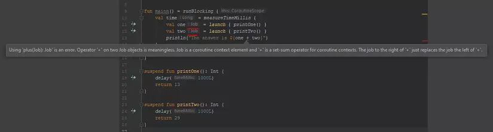
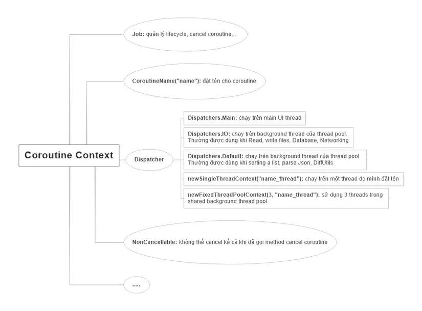

# I. Giới thiệu Kotlin Coroutine và kỹ thuật lập trình bất đồng bộ
```https://viblo.asia/p/cung-hoc-kotlin-coroutine-phan-1-gioi-thieu-kotlin-coroutine-va-ky-thuat-lap-trinh-bat-dong-bo-gGJ59xajlX2```
## 1. Đặt vấn đề
Xưa nay, các dev luôn phải đối mặt với một vấn đề cần giải quyết là làm thế nào để ứng dụng không bị block UI, tắc nghẽn khiến cho user ko thể thao tác tiếp tục được. Thực tế việc này rất dễ xảy ra khi chạy 1 tác vụ nặng trên main thread.

Để giải quyết bài toán trên, các dev buộc phải biết kỹ thuật lập trình bất đồng bộ. Có nhiều cách tiếp cận để giải quyết vấn đề này, bao gồm:

Threading.
Thread + Callbacks/Asynctask/Handler.
Reactive Extensions (Rx).
Coroutines.
Trước khi giải thích Coroutines là gì, hãy xem xét ngắn gọn một số giải pháp khác.

## 2. Một số giải pháp xử lý bất đồng bộ
### 2.1. Threading
Chúng ta sẽ thực thi tác vụ nặng trong 1 thread riêng khác main thread. Đoạn code dưới đây mô tả cách tạo và chạy 1 thread trong Kotlin.
```kotlin
thread(true) {
    executeLongTask()
}

```
Tuy nhiên, sử dụng Thread sẽ có 1 loạt các nhược điểm sau:

* Cái giá phải trả cho 1 thread là khá đắt. Thực tế, lạm dụng thread sẽ làm ảnh hưởng performance. Tham khảo thêm lý do tại đây: Why is creating a Thread said to be expensive?
* Số thread là hữu hạn, không phải vô hạn. Đây cũng là lý do khiến cho giá thread đắt đỏ 😄. Thử tưởng tượng, chúng ta đã sử dụng hết số thread, đến đoạn code nào đó chúng ta cần tạo thêm 1 thread để thực thi thì lấy đâu ra. Khi đó, app sẽ rơi vào trạng thái tắc nghẽn cổ chai (bottleneck).
* Sử dụng Thread không hề dễ. Debug thằng này thì khó thôi rồi. Deadlock, race conditions là những vấn đề phổ biến chúng ta sẽ gặp phải nếu không hiểu rõ về Thread.
* Thử tưởng tượng với đoạn code trên, nếu bạn đang cần callback từ thread đó đến main thread để update UI thì sẽ xử lý thế nào đây ???. Với nhược điểm lớn này, chúng ta sẽ khắc phục bằng cách sử dụng callback kết hợp với thread.

### 2.2. Thread + Callbacks / Async task / Handler
Sử dụng callback trong Kotlin đơn giản như đoạn code dưới đây:
```kotlin
override fun onCreate(savedInstanceState: Bundle?) {
    super.onCreate(savedInstanceState)
    setContentView(R.layout.activity_main)
    thread(true) {
        executeLongTask { taskDone ->
            textViewTaskName.text = taskDone
        }
    }
}

private fun executeLongTask(taskDone: (name: String) -> Unit) {
    taskDone.invoke("Viblo Report")
}

```
Nhìn đoạn code trên quá gọn nhỉ. Thầm nghĩ đây chính là giải pháp tuyệt vời nhất để giải quyết bài toán bất đồng bộ -> update UI rồi 😄. Thế nhưng đoạn code trên sẽ không còn gọn gàng nếu chúng ta buộc phải sử dụng các callback lồng nhau hay nối tiếp nhau. Ví dụ đoạn code yêu cầu đăng ký xong tài khoản -> đăng nhập -> get user detail:
```kotlin
fun register(newUser: User) {
    val username = newUser.getUsername()
    val password = newUser.getPassword()

    api.register(newUser, object : Callback<Boolean>() {
        fun onResponse(success: Boolean) {
            if (success) {
                api.login(AuthData(username, password), object : Callback<Token>() {
                    fun onResponse(token: Token) {
                        api.getUser(token, object : Callback<UserDetail>() {
                            fun onResponse(userDetail: UserDetail) {
                                // cuối cùng cũng đến Tây Thiên, get được userDetail rồi =))
                            }
                        })
                    }
                })
            }
        }
    })
}

```

Asynctask hay Handler khi xử lý lồng nhau cũng sẽ mất thẩm mỹ như vậy. Đó là nhược điểm chung của cả 3 thằng Thread + Callbacks / Asynctask / Handler.

Đợi đã, có vẻ như mình đã làm lố vấn đề bằng đoạn code trên. Thực tế, chúng ta có thể tuân thủ clean code bằng cách tạo function riêng cho từng chức năng cơ mà. Trông nó sẽ gọn hơn như sau:
```kotlin
fun register(newUser: User) {
    val username = newUser.getUsername()
    val password = newUser.getPassword()

    api.register(newUser, { success ->
        if (success) {
            login(username, password)
        }
    })
}

private fun login(username: String, password: String) {
    api.login(AuthData(username, password), { token -> getUserDetail(token) })
}

private fun getUserDetail(token: Token) {
    api.getUser(token, { userDetail ->
        // get được userDetail
    })
}

```
Nhìn cũng không tệ, thế nhưng chúng ta có một thứ có thể giải quyết nó gọn đẹp hơn. Đó là Reactive Extensions mà chúng ta hay gọi là Rx đấy 😄.

### 2.3. Rx
Bài toán trên qua bàn tay của Rx sẽ gọn gàng, đẹp đẽ như sau:
```kotlin
fun register(newUser: User) {
    val username = newUser.getUsername()
    val password = newUser.getPassword()

    api.register(newUser)
        .filter({ success -> success })
        .flatMap({ success -> api.login(AuthData(username, password)) })
        .flatMap({ token -> api.getUser(token) })
        .subscribe({ userDetails ->
            // get được userDetail
        })
}

```

Rx thì hoàn hảo quá rồi. Có nhược điểm gì đâu nhỉ. Thực tế có rất nhiều bài viết so sánh giữa Rx với Kotlin Coroutine. Có người về phe Rx, cũng có người về phe Coroutine. Mọi người có thể search anh Gồ để tìm hiểu thêm sự so sánh này. Nhưng theo quan điểm của mình, Rx là một thư viện lớn và đồ sộ, rất khó học đối với người mới. Thực tế, những bạn mới khi gặp phải những dự án sử dụng Rx thường gặp khó khăn trong vấn đề viết code và đọc hiểu nó trong thời gian đầu. Thôi thì những ai thấy Rx khó xơi như mình thì cùng học Kotlin Coroutine với mình vậy =)).

## 3. Kotlin Coroutine
Ở phần 1 này, mình sẽ không đi sâu vào các hàm, từ khóa của thư viện Kotlin Coroutine mà chỉ phân tích những ưu điểm của nó. Lý do nên xử dụng nó thay vì những thằng trên 😄. Chúng ta sẽ tìm hiểu về các hàm cũng như từ khóa trong Kotlin Coroutine ở Phần 2. Mình xin ví dụ 1 đoạn code sử dụng Kotlin Coroutine.
```kotlin
fun getTokenAndLogin() {
// launch a coroutine
    GlobalScope.launch {
        val token = getToken() // hàm getToken() này được chạy bất đồng bộ
        login(token)           // thế nhưng cách viết code lại giống như đang viết code đồng bộ (code từ trên xuống)
    }
}

suspend fun getToken(): String {
    // makes a request and suspends the coroutine
    return suspendCoroutine {
        // handle and return token
        it.resume("AdfGhhafHfjjryJjrtthhhFbgyhJjrhhBfrhghrjjyGHj")
    }
}

private fun login(token: String) {
    // TODO login with token
}

```

Khoan hãy quan tâm đến đoạn code trên. Mình sẽ giải thích rõ hơn về code ở phần 2 nhé 😄. Dựa vào code này, mình sẽ đưa ra một số ưu điểm của Coroutine khắc phục được các nhược điểm của các thằng trên:

Coroutines về cơ bản có thể hiểu nó như một "light-weight" thread, nhưng nó không phải là 1 thread, chúng chỉ hoạt động tương tự 1 thread. Hàng nghìn coroutines có thể được bắt đầu cùng một lúc, còn nếu hàng nghìn thread chạy thì performance sẽ trả 1 cái giá rất đắt. Tóm lại, giá phải trả cho 1 thread là rất đắt, còn coroutine thì gần như là hàng free. Quá tuyệt vời cho performance 😄
Như đã phân tích ở mục II, việc viết code xử lý bất đồng bộ rất là lộn xộn và khó debug. Còn với Kotlin Coroutine, code được viết như thể chúng ta đang viết code đồng bộ, từ trên xuống, không cần bất kỳ cú pháp đặc biệt nào, ngoài việc sử dụng một hàm gọi là launch. (Hàm này giúp khởi động coroutine và mình sẽ phân tích rõ hơn ở phần 2). Function xử lý task bất đồng bộ được viết giống y như khi ta viết function xử lý task đồng bộ. Sự khác biệt duy nhất là từ khóa suspend được thêm vào trước từ khóa fun. Và chúng ta có thể return bất kỳ kiểu dữ liệu nào chúng ta muốn. Điều mà Thread không làm được mà phải cần tới AsyncTask củ chuối.
Kotlin Coroutine là nền tảng độc lập. Cho dù bạn đang viết code JavaScript hay bất kỳ nền tảng nào khác, cách viết code implement Kotlin Coroutine sẽ đều giống nhau. Trình biên dịch sẽ đảm nhiệm việc điều chỉnh nó cho từng nền tảng.

**Kết luận**

Kết thúc phần 1, hy vọng bạn đã thấy được sự cần thiết của Kotlin Coroutine trong lập trình xử lý bất đồng bộ. Ở những phần tiếp theo, mình sẽ phân tích sâu vào thư viện Kotlin Coroutine và sự kết hợp Coroutine cùng Room và Retrofit. Cảm ơn các bạn vì đã đọc.

# II. Build first Coroutine with Kotlin
## 1. Những điểm cần chú ý ở phần 1
Ở phần 1, chúng ta đã tìm hiểu về định nghĩa về coroutine. Mình xin note lại một vài điểm lưu ý như sau:

* Coroutine giống như light-weight thread. Nhưng nó không phải là thread. Nó giống thread ở chỗ là các coroutine có thể chạy song song, đợi nhau và trao đổi dữ liệu với nhau. Sự khác biệt lớn nhất so với thread là coroutine rất rẻ, gần như là hàng free, chúng ta có thể chạy hàng nghìn coroutine mà gần như không ảnh hưởng lớn đến performance.
* Một thread có thể chạy nhiều coroutine.
* Coroutine không phải lúc nào cũng chạy trên background thread, chúng cũng có thể chạy trên main thread.
## 2. Build first coroutine with Kotlin
Để sử dụng được Kotlin Coroutine, bạn cần thêm 2 dependency sau:
```groovy
implementation 'org.jetbrains.kotlinx:kotlinx-coroutines-core:1.2.1'
implementation 'org.jetbrains.kotlinx:kotlinx-coroutines-android:1.1.1'
```
Một coroutine được cấu tạo gồm các thành phần sau:
```kotlin
GlobalScope.launch { // chạy một coroutine
        delay(10000L) // delay 10s nhưng ko làm blocking app
        println("World,") // print từ World ra sau khi hết delay
    }
    println("Hello,") // main thread vẫn tiếp tục chạy xuống dòng code này trong khi coroutine vẫn đang bị delay 10s
    Thread.sleep(20000L) // block main thread 20s
    println("Kotlin")

```
Đây là output của đoạn code trên:
```
Hello,  // Giả sử Hello, được in ra ở giây thứ 1
World,  // thì từ World, sẽ được in ra ở giây thứ 11
Kotlin  // và từ Kotlin sẽ được in ra ở giây thứ 21
```
* Bloc launch {} là một coroutine builder. Nó phóng một coroutine chạy đồng thời (concurrently) với các phần code còn lại. Đó là lý do từ "Hello" được print ra đầu tiên.

* GlobalScope là coroutine scope. Chúng ta không thể launch một coroutine nếu nó không có scope. Mình sẽ nói về Coroutine Scope trong các bài tiếp theo.

* Hàm delay() nhìn thì có vẻ giống hàm Thread.sleep() nhưng chúng rất khác nhau. Bởi vì hàm delay() là một suspend function, nó sẽ không block thread (non-blocking thread) còn hàm Thread.sleep() thì block thread. Vậy thế nào là non-blocking, thế nào là blocking?. Hàm suspend là hàm gì, nó khác gì với một hàm bình thường?
## 3. Blocking Vs Non-Blocking / Normal function vs suspend function
### 3.1. Blocking
Ví dụ 1 đoạn code sử dụng normal function mà chúng ta vẫn thường code:
```kotlin
fun functionA() { println("in ra A") }
fun functionB() { println("in ra B") }
fun main() {
       // chạy functionA và functionB
       functionA()
       functionB()
}

```
Sau khi ta chạy hàm main thì chuyện gì sẽ xảy ra. Main thread sẽ chạy xong hết functionA rồi mới chạy tiếp functionB. Các dòng lệnh, các hàm được thực hiện một cách tuần tự từ trên xuống dưới. Khi một dòng lệnh ở phía trước chưa được hoàn thành thì các dòng lệnh phía sau sẽ chưa được thực hiện và phải đợi khi mà thao tác phía trước hoàn tất.

Nếu như các dòng lệnh trước là các thao tác cần nhiều thời gian xử lý như liên quan đến IO (Input/Output) hay mạng (Networking) thì bản thân nó sẽ trở thành vật cản trở cho các lệnh xử lý phía sau mặc dù theo logic thì có những việc ở phía sau ta có thể xử lý được luôn mà không cần phải đợi vì chúng không có liên quan gì đến nhau.

Ví dụ như chúng ta cần get tất cả videos trong máy và get thông tin máy.
```kotlin
fun main() {
    getVideos() // Giả sử hàm này chạy mất hết 2 phút
    getInfo() // phải đợi hàm getVideos chạy xong mới được chạy trong khi hàm này chẳng liên quan gì đến getVideos
    updateUiInfo()
}

```
Như vậy người dùng phải chờ ít nhất 2 phút sau thì mới hiển thị được info lên màn hình.

### 3.2. Non-blocking
* Các dòng lệnh không nhất thiết phải lúc nào cũng phải thực hiện một cách tuần tự (sequential) và đồng bộ (synchronous) với nhau.
* Các dòng lệnh phía sau được chạy ngay sau khi dòng lệnh phía trước được gọi mà không cần đợi cho tới khi dòng lệnh phía trước chạy xong.
* Để thực hiện mô hình Non-Blocking, người ta có những cách để thực hiện khác nhau, nhưng về cơ bản vẫn dựa vào việc dùng nhiều Thread (luồng) khác nhau trong cùng một Process (tiến trình), hay thậm chí nhiều Process khác nhau (inter-process communication – IPC) để thực hiện.
Vậy coroutine có thể chạy non-blocking. Non-blocking nhưng không cần phải dựa vào việc dùng nhiều thread. Một thread chạy nhiều coroutine cũng có thể chạy được mô hình non-blocking.

### 3.3. Suspend function
Hình ảnh biểu diễn một thread đang chạy 2 function là functionA và functionB. Chúng ta có thể thấy thread đó phải chạy xong function A rồi mới đến functionB. Đây là cách chạy phổ biến của normal function mà chúng ta vẫn hay code.


Suspend function cho phép ta làm được điều vi diệu hơn. Đó là suspend function có khả năng ngừng hay gián đoạn việc thực thi một lát (trạng thái ngừng là trạng thái suspend) và có thể tiếp tục thực thi lại khi cần thiết. Như hình ảnh dưới đây: functionA bị gián đoạn để functionB chạy và sau khi functionB chạy xong thì function A tiếp tục chạy tiếp.


Một vài lưu ý với suspend function:

* Suspend function được đánh dấu bằng từ từ khóa suspend. VD:
```kotlin
suspend fun sayHello() {
    delay(1000L)
    println("Hello!")
}

```
* Chỉ có thể được gọi suspend function bên trong một suspend function khác hoặc bên trong một coroutine. Ví dụ hàm delay trong đoạn code trên là một suspend function và chỉ được gọi trong hàm suspend function khác là hàm sayHello. Nếu ta xóa từ khóa suspend trong hàm sayHello thì hàm sayHello sẽ không còn là suspend function nữa mà chỉ là một function bình thường. Khi đó hàm delay sẽ bị lỗi compile như sau:
```
Error: Kotlin: Suspend functions are only allowed to be called from a coroutine or another suspend function
```
### 3.4. Run blocking with coroutine
Nếu như ở phần trên, các bạn đã biết coroutine có khả năng chạy mà non-blocking thread. Giả sử, trong trường hợp bạn muốn coroutine chạy blocking thread (chạy tuần tự) thì sao?

Khi đó chúng ta sẽ có block runBlocking { }. Tương tự như block launch { } được dùng ví dụ ở mục 2., bên trong block runBlocking { } cũng là một coroutine được tạo ra và chạy.
```kotlin
runBlocking { // chạy một coroutine
   println("Hello")
   delay(5000)
}
println("World")

```
Output của đoạn code này là:
```
Output: 22:00:20 I/System.out: Hello
        22:00:25 I/System.out: World
```
Nếu để ý ta sẽ thấy từ World được in ra sau từ Hello là 5 giây. Như vậy có nghĩa là main thread đã bị blocking chờ khi xong hàm delay 5s mới chạy xuống đoạn code println("World").

Chúng ta có thể viết lại đoạn code trên theo style code mới:
```kotlin
private fun main() = runBlocking { 
   println("Hello")
   delay(5000)
}

override fun onCreate(savedInstanceState: Bundle?) {
   super.onCreate(savedInstanceState)
   main()
   println("World")
}

```
### 5.5. Coroutines are light-weight thead
Bây giờ mình sẽ chứng minh rằng coroutine nhẹ như thế nào so với thread. Mình sẽ cho chạy một function, function này sẽ khởi tạo và chạy 100.000 con coroutine song song và mình sẽ đo tổng thời gian thực hiện xong function đó.
```kotlin
val time = measureTimeMillis { main() }
Log.d("hehehe", "time = $time ms")

fun main() = runBlocking {
       repeat(100_000) { // launch 100_000 coroutines
           launch {
               Log.d("hehehe", "hello")
           }
       }
}

```
Output là:
```
7129 ms
```
Thật không thể tin nổi. Chỉ mất có 7s thôi! Mình sẽ không khuyến khích các bạn chạy 100.000 thread để so sánh với kết quả này đâu nhé =))
**Kết luận**

Kết thúc phần 2, hy vọng bạn đã build được coroutine đầu tiên, hiểu được các khái niệm như blocking, non-blocking và suspend function cũng như thấy được sức mạnh và lợi ích mà coroutine mang đến cho dev chúng ta. Ở những phần tiếp theo, mình sẽ đi tiếp vào các khái niệm như Coroutine Cancellation, Coroutine Context, Coroutine Scope, sự kết hợp Coroutine cùng Room và Retrofit và cách xử lý lỗi trong Kotlin Coroutine. Cảm ơn các bạn đã theo dõi bài viết này. Hy vọng các bạn sẽ tiếp tục theo dõi những phần tiếp theo 😄


# III. Coroutine Context và Dispatcher
## 1. Coroutine Context
Mỗi coroutine trong Kotlin đều có một **context** được thể hiện bằng một instance của interface `CoroutineContext`. Context này là một tập các element cấu hình cho coroutine.

### 1.1. Các loại element
Các loại element trong coroutine context gồm:

**Job:** nắm giữ thông tin về lifecycle của coroutine

**Dispatcher:** Quyết định thread nào mà coroutine sẽ chạy trên đó. Có các loại dispatcher sau:

* **Dispatchers.Main:** chạy trên main UI thread

* **Dispatchers.IO:** chạy trên background thread của thread pool. Thường được dùng khi Read, write files, Database, Networking

* **Dispatchers.Default:** chạy trên background thread của thread pool. Thường được dùng khi sorting a list, parse Json, DiffUtils

* **newSingleThreadContext("name_thread"):** chạy trên một thread do mình đặt tên

* **newFixedThreadPoolContext(3, "name_thread"):** sử dụng 3 threads trong shared background thread pool

**Job và Dispatcher** là 2 element chính trong CoroutineContext. Ngoài ra còn một số element khác như:

* **CoroutineName("name"):** đặt tên cho coroutine

* **NonCancellable:** không thể cancel kể cả khi đã gọi method cancel coroutine

Các element này sẽ được mình giải thích rõ hơn qua code example trong các mục bên dưới.


### 1.2. Toán thử plus (+) để thêm các element vào coroutineContext
Sử dụng toán tử cộng để set nhiều loại element cho coroutine context như sau:
```kotlin
// set context khi sử dụng runBlocking { } để start coroutine
runBlocking(Dispatchers.IO + Job()) {
}

// hoặc set context khi sử dụng launch { } để start coroutine
GlobalScope.launch(newSingleThreadContext("demo_thread") + CoroutineName("demo_2") + NonCancellable) {

}

```

### 1.3. Default Context
Nếu không set coroutine context cho coroutine thì default nó sẽ nhận `Dispatchers.Default` làm dispatcher và tạo ra một **Job()** để quản lý coroutine.
```kotlin
GlobalScope.launch {
        // tương đương với GlobalScope.launch (Dispatchers.Default + Job()) { }
}

```

### 1.4. Get coroutine context qua biến coroutineContext
Chúng ta có thể get được context coroutine thông qua property `coroutineContext` trong mỗi coroutine.
```kotlin
fun main() = runBlocking<Unit> {
    println("My context is: $coroutineContext")
}

```
Chúng ta có thể thêm các element vào một `coroutineContext` bằng cách sử dụng **toán tử cộng +**
```kotlin
fun main() = runBlocking<Unit> {
    println("A context with name: ${coroutineContext + CoroutineName("test")}")
}

```

## 2. Hàm withContext
Nó là một suspend function cho phép coroutine chạy code trong block với một context cụ thể do chúng ta quy định. Ví dụ chúng ta sẽ chạy đoạn code dưới và sẽ print ra context và thread để kiểm tra:
```kotlin
fun main() {
    newSingleThreadContext("thread1").use { ctx1 ->
        // tạo một context là ctx1 chứ chưa launch coroutine. 
        // ctx1 sẽ có 1 element là dispatcher quyết định coroutine sẽ chạy trên 1 thread tên là thread1
   		println("ctx1 - ${Thread.currentThread().name}")
        
   		newSingleThreadContext("thread2").use { ctx2 ->
             // tạo một context là ctx2 chứ vẫn chưa launch coroutine
             // ctx2 sẽ có 1 element là dispatcher quyết định coroutine sẽ chạy trên 1 thread tên là thread2
       		println("ctx2 - ${Thread.currentThread().name}")
            
            // bắt đầu chạy coroutine với context là ctx1
       		runBlocking(ctx1) {
                    // coroutine đang chạy trên context ctx1 và trên thread thread1
           			println("Started in ctx1 - ${Thread.currentThread().name}")
                    
                    // sử dụng hàm withContext để chuyển đổi context từ ctx1 qua ctx2
           			withContext(ctx2) {
                        // coroutine đang chạy với context ctx2 và trên thread thread2
               			println("Working in ctx2 - ${Thread.currentThread().name}")
           			}
                    
                    // coroutine đã thoát ra block withContext nên sẽ chạy lại với context ctx1 và trên thread thread1
           			println("Back to ctx1 - ${Thread.currentThread().name}")
       		}
   		}
        
  		println("out of ctx2 block - ${Thread.currentThread().name}")
   	}
    
    println("out of ctx1 block - ${Thread.currentThread().name}")
}

```

Output của đoạn code trên:
```
ctx1 - main
ctx2 - main
Started in ctx1 - thread1
Working in ctx2 - thread2
Back to ctx1 - thread1
out of ctx2 block - main
out of ctx1 block - main
```

Công dụng tuyệt vời của hàm withContext sẽ được chúng ta sử dụng hầu hết trong các dự án. Cụ thể chúng ta sẽ get data dưới background thread và cần UI thread để update UI:
```kotlin
GlobalScope.launch(Dispatchers.IO) {
    // do background task
    withContext(Dispatchers.Main) {
	// update UI
   }
}

```

## 3. Các loại Dispatcher trong Coroutine
### 3.1. Dispatchers and threads
Bây giờ sẽ code example để giải thích cụ thể các loại dispatcher mà mình đã giới thiệu ở trên.
```kotlin
fun main() = runBlocking<Unit> {
    launch(Dispatchers.Unconfined) { // not confined -- will work with main thread
        println("Unconfined            : I'm working in thread ${Thread.currentThread().name}")
    }
    launch(Dispatchers.Default) { // will get dispatched to DefaultDispatcher 
        println("Default               : I'm working in thread ${Thread.currentThread().name}")
    }
    launch(newSingleThreadContext("MyOwnThread")) { // will get its own new thread
        println("newSingleThreadContext: I'm working in thread ${Thread.currentThread().name}")
    }    
}

```
Output của đoạn code trên:
```
Unconfined            : I'm working in thread main
Default               : I'm working in thread DefaultDispatcher-worker-1
newSingleThreadContext: I'm working in thread MyOwnThread
```
Kết quả in ra khi sử dụng `Dispatchers.Default` và `newSingleThreadContext("MyOwnThread")` chẳng có gì là lạ, giống y như những gì mình đã giới thiệu về các Dispatcher ở trên 😄. Tuy nhiên `Dispatchers.Unconfined` là gì?. Tại sao nó lại điều phối cho coroutine chạy trên main thread. Trong khi để điều phối coroutine chạy trên main thread đã có `Dispatchers.Main` rồi. Vậy nó có gì đặc biệt?

### 3.2. Unconfined dispatcher
Để biết được `Dispatchers.Unconfined` khác `Dispatchers.Main` chỗ nào. Chúng ta sẽ cho chạy đoạn code sau:
```kotlin
fun main() = runBlocking {
        launch(Dispatchers.Unconfined) { // chưa được confined (siết lại) nên nó sẽ chạy trên main thread
            println("Unconfined      : I'm working in thread ${Thread.currentThread().name}")
            delay(1000)
            // hàm delay() sẽ làm coroutine bị suspend sau đó resume lại
            println("Unconfined      : After delay in thread ${Thread.currentThread().name}")
        }
    }

```
Ouput của đoạn code trên là:
```
Unconfined      : I'm working in thread main
Unconfined      : After delay in thread kotlinx.coroutines.DefaultExecutor
```
Kết quả là ban đầu coroutine chạy trên main thread. Sau khi bị delay 1 giây thì chạy tiếp trên background thread chứ không phải chạy trên main thread nữa.

Bởi vì dispatcher `Dispatchers.Unconfined` này chạy một coroutine không giới hạn bất kỳ thread cụ thể nào. Ban đầu coroutine chưa được confined (tạm dịch là siết lại vậy 😄) thì nó sẽ chạy trên current thread. Ở đây current thread đang chạy là main thread nên nó sẽ chạy trên main thread cho đến khi nó bị suspend (ở đây ta dùng hàm delay để suspend nó). Sau khi coroutine đó resume thì nó sẽ không chạy trên current thread nữa mà chạy trên background thread.

## 4. Đặt tên cho coroutine
Để đặt tên cho coroutine ta sử dụng element CoroutineName(name: String) set vào coroutineContext.
```kotlin
GlobalScope.launch(CoroutineName("demo_2")) {
        // coroutine được đặt tên là demo_2
}

```

**Kết luận**

Kết thúc phần 3, hy vọng bạn đã hiểu về CoroutineContext và các element của nó. Biết cách sử dụng Dispatcher để điều phối thread cho coroutine và biết cách đặt tên coroutine bằng CoroutineName. Các element còn lại như Job, NonCancellable sẽ được mình tiếp tục giải thích trong phần tiếp theo. Cảm ơn các bạn đã theo dõi bài viết này. Hy vọng các bạn sẽ tiếp tục theo dõi những phần tiếp theo 😄

# IV. Job, Join, Cancellation và Timeouts
## 1. Job - một element trong coroutine context
Như chúng ta đã biết ở phần 3: Trong coroutine context có một element là `Job` giữ nhiệm vụ nắm giữ thông tin về lifecycle của coroutine, cancel coroutine, .... Mỗi khi chúng ta launch một coroutine thì nó trả về một đối tượng `Job` này.

```kotlin
val job = GlobalScope.launch { // launch a new coroutine and keep a reference to its Job
       delay(5000L)
       println("World!")
   }

```
Ở những mục tiếp theo của bài viết này, chúng ta sẽ được giới thiệu một số property và method hay dùng liên quan đến đối tượng job này.

## 2. Hàm join() - hãy đợi coroutine chạy xong đã!
Chúng ta có thể sử dụng đối tượng `Job` để thực hiện một số method có sẵn trong mỗi coroutine. Ví dụ ở đây mình sử dụng hàm `join()`. Khi một coroutine gọi hàm `join()` này thì tiến trình phải đợi coroutine này chạy xong task của mình rồi mới chạy tiếp. Ví dụ:
```kotlin
fun main() = runBlocking {
   val job = GlobalScope.launch { // launch a new coroutine and keep a reference to its Job
       delay(5000L)
       println("World!")
   }
   println("Hello,")
   job.join() // wait until child coroutine completes
   println("Kotlin")
}

```
Output:
```
22:07:20 I/System.out: Hello
22:07:25 I/System.out: World
22:07:25 I/System.out: Kotlin
```

Nhìn output ta có thể dễ dàng thấy khi tiến trình chạy xong dòng code in ra từ `Hello,` thì nó gặp lệnh join() và nó không tiếp tục chạy xuống dòng code bên dưới để in tiếp từ `Kotlin` mà chờ coroutine chạy xong task để in ra từ `World` trước cái đã. Đó là công dụng của hàm `join()`

## 3. Hàm cancel() - hủy bỏ một coroutine
Để dừng và hủy bỏ một coroutine đang chạy. Ta có thể dùng method `cancel()` của biến `Job`
```kotlin
fun main() = runBlocking {
    val job = launch {
        repeat(1000) { i ->
            println("I'm sleeping $i ...")
            delay(500L)
        }
    }
    delay(1300L) // delay a bit
    println("main: I'm tired of waiting!")
    job.cancel() // cancels the job
    println("main: Now I can quit.")    
}

```

Output:
```
I'm sleeping 0 …
I'm sleeping 1 …
I'm sleeping 2 …
main: I'm tired of waiting!
main: Now I can quit.
```
Ở đoạn code trên, mình cho phóng một coroutine và bảo nó in ra câu `I'm sleeping ...` cứ mỗi 500 ms và in đủ 1000 lần như vậy. Và đoạn code dưới, mình cho tiến trình delay 1300 ms trước khi cancel con coroutine mình đã phóng. Kết quả là sau 1300 ms, nó mới chỉ in được có 3 câu `I'm sleeping ...` mà nó đã bị hủy bỏ nên không in tiếp được nữa 😄

## 4. Những lưu ý khi hủy bỏ một coroutine
### 4.1. Coroutine cancellation is cooperative
Thử dùng hàm cancel() để hủy bỏ coroutine trong đoạn code sau:
```kotlin
fun main() = runBlocking {
    val startTime = System.currentTimeMillis()
    val job = launch(Dispatchers.Default) {
        var nextPrintTime = startTime
        var i = 0
        while (i < 5) {
            if (System.currentTimeMillis() >= nextPrintTime) {
                println("job: I'm sleeping ${i++} ...")
                nextPrintTime += 500L
            }
        }
    }
    delay(1300L) // delay a bit
    println("main: I'm tired of waiting!")
    job.cancel() // cancels the job
    println("main: Now I can quit.")
}

```
Output:
```
job: I'm sleeping 0 ...
job: I'm sleeping 1 ...
job: I'm sleeping 2 ...
main: I'm tired of waiting!
main: Now I can quit.
job: I'm sleeping 3 ...
job: I'm sleeping 4 ...
```

Ôi, thật bất ngờ!. Đoạn code trên, mình cũng cho phóng một coroutine và bảo nó in ra câu `I'm sleeping ...` cứ mỗi 500 ms và in đủ 5 lần như vậy. Tuy nhiên sau 1300 ms, mình đã gọi hàm `cancel()` để hủy bỏ corotine đó, tức là nó chỉ có đủ thời gian để in ra được 3 câu `I'm sleeping ...` nhưng thực tế output cho thấy nó vẫn chạy bất chấp và in ra đủ 5 câu `I'm sleeping ...` =))

Đó là vì quá trình hủy bỏ coroutine có tính hợp tác (Coroutine cancellation is cooperative). Một coroutine khi bị `cancel` thì nó sẽ chỉ set lại một property có tên là `isActive` trong đối tượng `Job` từ `true` thành `false (job.isActive = false)`, còn tiến trình của nó đang chạy thì sẽ vẫn chạy bất chấp cho đến hết mà không bị dừng lại. Vậy tại sao, ở đoạn code trong phần 2, tiến trình của coroutine lại được hủy bỏ thành công. Đó là vì hàm `delay(500L)` ngoài chức năng delay thì bản thân nó cũng có một chức năng có thể check coroutine này còn sống hay không, nếu không còn sống `(job.isActive == false)` nó sẽ hủy bỏ tiến trình của coroutine đó ngay và luôn. Không chỉ riêng hàm `delay()` mà tất cả các hàm suspend function trong package `kotlinx.coroutines` đều có khả năng check này.

Vậy chúng ta đã biết thêm một property tuyệt vời của đối tượng `Job` là `isActive`. Nó giúp chúng ta kiểm tra xem coroutine đã bị cancel hay chưa. Thử áp dụng nó vào code để kịp thời ngăn chặn tiến trình của coroutine khi đã có lệnh hủy bỏ coroutine đó xem nào 😄

```kotlin
fun main() = runBlocking {
    val startTime = System.currentTimeMillis()
    val job = launch(Dispatchers.Default) {
        var nextPrintTime = startTime
        var i = 0
        while (isActive) {   // Điều kiện i < 5 đã được thay bằng isActive để ngăn chặn coroutine khi nó đã bị hủy
            if (System.currentTimeMillis() >= nextPrintTime) {
                println("job: I'm sleeping ${i++} ...")
                nextPrintTime += 500L
            }
        }
    }
    delay(1300L) // delay a bit
    println("main: I'm tired of waiting!")
    job.cancel() // cancels the job
    println("main: Now I can quit.")
}

```
Output:
```
job: I'm sleeping 0 ...
job: I'm sleeping 1 ...
job: I'm sleeping 2 ...
main: I'm tired of waiting!
main: Now I can quit.
```
Tuyệt vời!. Nếu như không có biến `isActive` thì vòng lặp `while` sẽ làm cho coroutine in ra vô số câu `I'm sleeping ...`. Nhờ có điều kiện `isActive` nên chúng ta đã ngăn chặn được coroutine sau khi nó đã bị hủy bỏ, khiến nó chỉ có thể in ra 3 câu `I'm sleeping ...`.

### 4.2. Sử dụng khối finally để close resource ngay cả khi coroutine đã bị hủy bỏ.
Nếu tiến trình của một coroutine bị hủy bỏ thì ngay lập tức nó sẽ tìm đến khối `finally` để chạy code trong đó. Chúng ta có thể sử dụng đặc điểm này để tranh thủ close hết các resource trước khi coroutine đó chính thức bị khai tử 😄
```kotlin
fun main() = runBlocking {
    val job = launch {
        try {
            repeat(1000) { i ->
                println("I'm sleeping $i ...")
                delay(500L)
            }
        } finally {
            // Tranh thủ close resource trong này đi nha :D
            println("I'm running finally")
        }
    }
    delay(1300L) // delay a bit
    println("main: I'm tired of waiting!")
    job.cancel() // cancels the job
    println("main: Now I can quit.")
}

```
Output:
```
I'm sleeping 0 ...
I'm sleeping 1 ...
I'm sleeping 2 ...
main: I'm tired of waiting!
main: Now I can quit.
I'm running finally
```

Như chúng ta thấy trong kết quả output, ngay cả khi coroutine bị dừng không thể tiếp tục in ra những câu `I'm sleeping ...` và đã chạy đến dòng code cuối để in ra câu `main: Now I can quit.` mà nó vẫn cố gắng chạy vào khối `finally` để in ra câu `I'm running finally` trước khi trút hơi thở cuối cùng 😄
### 4.3. Coroutine vẫn có thể chết trong khối finally
Bây giờ, thử để hàm delay() bên trong khối finally của đoạn code trên thử xem:
```kotlin
fun main() = runBlocking {
    val job = launch {
        try {
            repeat(1000) { i ->
                println("I'm sleeping $i ...")
                delay(500L)
            }
        } finally {
            println("I'm running finally")
            delay(1000L)                      // hàm delay được thêm vào khối finally
            println("Print me please!")
        }
    }
    delay(1300L) // delay a bit
    println("main: I'm tired of waiting!")
    job.cancel() // cancels the job
    println("main: Now I can quit.")
}

```
Output:
```
I'm sleeping 0 ...
I'm sleeping 1 ...
I'm sleeping 2 ...
main: I'm tired of waiting!
main: Now I can quit.
I'm running finally
```
What!. Tại sao coroutine chạy vào khối `finally` in ra được câu `I'm running finally` nhưng lại không thể tiếp tục chạy xuống code dưới để in ra câu `Print me please!`. Tất cả tại thằng hàm `delay()`. Như mình đã nói ở trên, hàm `delay()` nó riêng hay tất cả hàm suspend function nói chung có khả năng check xem coroutine còn sống không. Nếu nó đã chết thì tiến trình lập tức bị dừng lại ngay khi chạy vào hàm `delay()` này. Vậy thì câu `Print me please!` tất nhiên sẽ không được in ra rồi =))

### 4.4. Làm cho coroutine bất tử
Vậy giả sử bây giờ chúng ta muốn nó thực thi bất chấp tất cả dòng code trong khối `finally` thì làm cách nào?. Vẫn có cách nhé. Một element thuộc coroutine context có tên là `NonCancellable` sẽ giúp ta thực hiện điều này.
```kotlin
fun main() = runBlocking {
    val job = launch {
        try {
            repeat(1000) { i ->
                println("I'm sleeping $i ...")
                delay(500L)
            }
        } finally {
            withContext(NonCancellable) {  // Nhờ có em NonCancellable mà anh được phép chạy bất chấp đấy
                println("I'm running finally")
                delay(1000L)
                println("I'm non-cancellable")
            }
        }
    }
    delay(1300L) // delay a bit
    println("main: I'm tired of waiting!")
    job.cancel() // cancels the job
    println("main: Now I can quit.")    
}

```
Output:
```
I'm sleeping 0 ...
I'm sleeping 1 ...
I'm sleeping 2 ...
main: I'm tired of waiting!
main: Now I can quit.
I'm running finally
I'm non-cancellable
```

Ở đoạn code trên, có 2 kiến thức lạ là `NonCancellable` và hàm `withContext()`.
* Hàm `withContext()` có tác dụng điều chỉnh lại context của coroutine. Cụ thể trước đó coroutine lúc mới được sinh ra thì bản thân nó default là Cancellable (có thể hủy bỏ được) nhưng khi coroutine chạy được một lúc rồi mình lại muốn nó đổi context thành `NonCancellable` (không thể hủy bỏ được). Khi đó hàm `withContext()` sẽ giúp chúng ta thực hiện việc điều chỉnh đó. Công dụng khác của hàm `withContext()` có thể kể đến như một coroutine thực thi task dưới background thread (`Dispatchers.IO`) và sau khi xong task thì cho nó chạy tiếp trên main thread `withContext(Dispatchers.Main)` để update UI chẳng hạn. Mình sẽ nói nhiều hơn về hàm `withContext()` ở các bài sau nhé 😄.
* `NonCancellable` là một element trong tập context của coroutine. Công dụng của nó là khiến cho coroutine trở nên bất tử, không thứ gì có thể khiến nó dừng lại cho đến khi nó hoàn thành xong task nhé =))

## 5. Timeout - cho coroutine chết bằng cách hẹn giờ
Chúng ta có thể ra lệnh cho coroutine: "Nhà ngươi hãy làm task này cho ta trong vòng 10 giây, nếu hết 10 giây mà ngươi vẫn làm chưa xong thì hãy chết đi!". Hàm `withTimeout(truyền_vào_khoảng_thời_gian_đơn_vị_ms)` sẽ cho ta cái quyền lực như vậy.

```kotlin
fun main() = runBlocking {
    withTimeout(1300L) {
        repeat(1000) { i ->
            println("I'm sleeping $i ...")
            delay(500L)
        }
    }
}

```

```
I'm sleeping 0 ...
I'm sleeping 1 ...
I'm sleeping 2 ...
Exception in thread "main" kotlinx.coroutines.TimeoutCancellationException: Timed out waiting for 1300 ms
```
WTF!. Sao lại gặp `Exception`!. Đúng vậy. Hàm` withTimeout()` khá là gắt khi nó thấy hết thời gian timeout mà vẫn chưa thấy coroutine xong task nó sẽ `throw TimeoutCancellationException`. Điều này đồng nghĩa với việc sẽ không có `Exception` nào xảy ra nếu coroutine hoàn thành task trước khi hết thời gian timeout.

Chúng ta có hàm `withTimeoutOrNull(truyền_vào_khoảng_thời_gian_đơn_vị_ms)` có công dụng như hàm `withTimeout()` nhưng bớt gắt hơn. Thay vì `throw TimeoutCancellationException` thì bản thân hàm `withTimeoutOrNull()` sẽ return về một biến `null` khi hết thời gian timeout rồi mà coroutine vẫn chưa xong task.

```kotlin
fun main() = runBlocking {
    val result = withTimeoutOrNull(1300L) {
        repeat(1000) { i ->
                println("I'm sleeping $i ...")
            delay(500L)
        }
        "Done" // will get cancelled before it produces this result
    }
    println("Result is $result")                // Biến result sẽ null
}

```
Output:
```
I'm sleeping 0 ...
I'm sleeping 1 ...
I'm sleeping 2 ...
Result is null
```

**Kết luận**

Kết thúc phần 4, hy vọng bạn đã nắm rõ các kiến thức liên quan đến việc cancel một coroutine. Cảm ơn các bạn đã theo dõi bài viết này. Hy vọng các bạn sẽ tiếp tục theo dõi những phần tiếp theo. 😄

# V. Async & Await
# VI. Coroutine Scope
# VII. Xử lý Exception trong Coroutine, Supervision Job & Supervision Scope 
# VIII. Flow (part 1 of 3)
# IX. Flow (part 2 of 3)
# X. Flow (part 3 of 3)
# XI. Channels (part 1 of 2)
# XII. Channels (part 2 of 2)