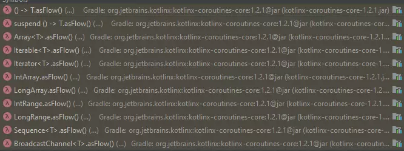

# I. Giới thiệu Kotlin Coroutine và kỹ thuật lập trình bất đồng bộ

`https://viblo.asia/p/cung-hoc-kotlin-coroutine-phan-1-gioi-thieu-kotlin-coroutine-va-ky-thuat-lap-trinh-bat-dong-bo-gGJ59xajlX2`

## 1. Đặt vấn đề

Xưa nay, các dev luôn phải đối mặt với một vấn đề cần giải quyết là làm thế nào để ứng dụng không bị block UI, tắc nghẽn khiến cho user ko thể thao tác tiếp tục được. Thực tế việc này rất dễ xảy ra khi chạy 1 tác vụ nặng trên main thread.

Để giải quyết bài toán trên, các dev buộc phải biết kỹ thuật lập trình bất đồng bộ. Có nhiều cách tiếp cận để giải quyết vấn đề này, bao gồm:

- Threading.
- Thread + Callbacks/Asynctask/Handler.
- Reactive Extensions (Rx).
- Coroutines.
  Trước khi giải thích Coroutines là gì, hãy xem xét ngắn gọn một số giải pháp khác.

## 2. Một số giải pháp xử lý bất đồng bộ

### 2.1. Threading

Chúng ta sẽ thực thi tác vụ nặng trong 1 thread riêng khác main thread. Đoạn code dưới đây mô tả cách tạo và chạy 1 thread trong Kotlin.

```kotlin
thread(true) {
    executeLongTask()
}

```

Tuy nhiên, sử dụng Thread sẽ có 1 loạt các nhược điểm sau:

- Cái giá phải trả cho 1 thread là khá đắt. Thực tế, lạm dụng thread sẽ làm ảnh hưởng performance. Tham khảo thêm lý do tại đây: Why is creating a Thread said to be expensive?
- Số thread là hữu hạn, không phải vô hạn. Đây cũng là lý do khiến cho giá thread đắt đỏ 😄. Thử tưởng tượng, chúng ta đã sử dụng hết số thread, đến đoạn code nào đó chúng ta cần tạo thêm 1 thread để thực thi thì lấy đâu ra. Khi đó, app sẽ rơi vào trạng thái tắc nghẽn cổ chai (bottleneck).
- Sử dụng Thread không hề dễ. Debug thằng này thì khó thôi rồi. Deadlock, race conditions là những vấn đề phổ biến chúng ta sẽ gặp phải nếu không hiểu rõ về Thread.
- Thử tưởng tượng với đoạn code trên, nếu bạn đang cần callback từ thread đó đến main thread để update UI thì sẽ xử lý thế nào đây ???. Với nhược điểm lớn này, chúng ta sẽ khắc phục bằng cách sử dụng callback kết hợp với thread.

### 2.2. Thread + Callbacks / Async task / Handler

Sử dụng callback trong Kotlin đơn giản như đoạn code dưới đây:

```kotlin
override fun onCreate(savedInstanceState: Bundle?) {
    super.onCreate(savedInstanceState)
    setContentView(R.layout.activity_main)
    thread(true) {
        executeLongTask { taskDone ->
            textViewTaskName.text = taskDone
        }
    }
}

private fun executeLongTask(taskDone: (name: String) -> Unit) {
    taskDone.invoke("Viblo Report")
}

```

Nhìn đoạn code trên quá gọn nhỉ. Thầm nghĩ đây chính là giải pháp tuyệt vời nhất để giải quyết bài toán bất đồng bộ -> update UI rồi 😄. Thế nhưng đoạn code trên sẽ không còn gọn gàng nếu chúng ta buộc phải sử dụng các callback lồng nhau hay nối tiếp nhau. Ví dụ đoạn code yêu cầu đăng ký xong tài khoản -> đăng nhập -> get user detail:

```kotlin
fun register(newUser: User) {
    val username = newUser.getUsername()
    val password = newUser.getPassword()

    api.register(newUser, object : Callback<Boolean>() {
        fun onResponse(success: Boolean) {
            if (success) {
                api.login(AuthData(username, password), object : Callback<Token>() {
                    fun onResponse(token: Token) {
                        api.getUser(token, object : Callback<UserDetail>() {
                            fun onResponse(userDetail: UserDetail) {
                                // cuối cùng cũng đến Tây Thiên, get được userDetail rồi =))
                            }
                        })
                    }
                })
            }
        }
    })
}

```

Asynctask hay Handler khi xử lý lồng nhau cũng sẽ mất thẩm mỹ như vậy. Đó là nhược điểm chung của cả 3 thằng Thread + Callbacks / Asynctask / Handler.

Đợi đã, có vẻ như mình đã làm lố vấn đề bằng đoạn code trên. Thực tế, chúng ta có thể tuân thủ clean code bằng cách tạo function riêng cho từng chức năng cơ mà. Trông nó sẽ gọn hơn như sau:

```kotlin
fun register(newUser: User) {
    val username = newUser.getUsername()
    val password = newUser.getPassword()

    api.register(newUser, { success ->
        if (success) {
            login(username, password)
        }
    })
}

private fun login(username: String, password: String) {
    api.login(AuthData(username, password), { token -> getUserDetail(token) })
}

private fun getUserDetail(token: Token) {
    api.getUser(token, { userDetail ->
        // get được userDetail
    })
}

```

Nhìn cũng không tệ, thế nhưng chúng ta có một thứ có thể giải quyết nó gọn đẹp hơn. Đó là Reactive Extensions mà chúng ta hay gọi là Rx đấy 😄.

### 2.3. Rx

Bài toán trên qua bàn tay của Rx sẽ gọn gàng, đẹp đẽ như sau:

```kotlin
fun register(newUser: User) {
    val username = newUser.getUsername()
    val password = newUser.getPassword()

    api.register(newUser)
        .filter({ success -> success })
        .flatMap({ success -> api.login(AuthData(username, password)) })
        .flatMap({ token -> api.getUser(token) })
        .subscribe({ userDetails ->
            // get được userDetail
        })
}

```

Rx thì hoàn hảo quá rồi. Có nhược điểm gì đâu nhỉ. Thực tế có rất nhiều bài viết so sánh giữa Rx với Kotlin Coroutine. Có người về phe Rx, cũng có người về phe Coroutine. Mọi người có thể search anh Gồ để tìm hiểu thêm sự so sánh này. Nhưng theo quan điểm của mình, Rx là một thư viện lớn và đồ sộ, rất khó học đối với người mới. Thực tế, những bạn mới khi gặp phải những dự án sử dụng Rx thường gặp khó khăn trong vấn đề viết code và đọc hiểu nó trong thời gian đầu. Thôi thì những ai thấy Rx khó xơi như mình thì cùng học Kotlin Coroutine với mình vậy =)).

## 3. Kotlin Coroutine

Ở phần 1 này, mình sẽ không đi sâu vào các hàm, từ khóa của thư viện Kotlin Coroutine mà chỉ phân tích những ưu điểm của nó. Lý do nên xử dụng nó thay vì những thằng trên 😄. Chúng ta sẽ tìm hiểu về các hàm cũng như từ khóa trong Kotlin Coroutine ở Phần 2. Mình xin ví dụ 1 đoạn code sử dụng Kotlin Coroutine.

```kotlin
fun getTokenAndLogin() {
// launch a coroutine
    GlobalScope.launch {
        val token = getToken() // hàm getToken() này được chạy bất đồng bộ
        login(token)           // thế nhưng cách viết code lại giống như đang viết code đồng bộ (code từ trên xuống)
    }
}

suspend fun getToken(): String {
    // makes a request and suspends the coroutine
    return suspendCoroutine {
        // handle and return token
        it.resume("AdfGhhafHfjjryJjrtthhhFbgyhJjrhhBfrhghrjjyGHj")
    }
}

private fun login(token: String) {
    // TODO login with token
}

```

Khoan hãy quan tâm đến đoạn code trên. Mình sẽ giải thích rõ hơn về code ở phần 2 nhé 😄. Dựa vào code này, mình sẽ đưa ra một số ưu điểm của Coroutine khắc phục được các nhược điểm của các thằng trên:

Coroutines về cơ bản có thể hiểu nó như một "light-weight" thread, nhưng nó không phải là 1 thread, chúng chỉ hoạt động tương tự 1 thread. Hàng nghìn coroutines có thể được bắt đầu cùng một lúc, còn nếu hàng nghìn thread chạy thì performance sẽ trả 1 cái giá rất đắt. Tóm lại, giá phải trả cho 1 thread là rất đắt, còn coroutine thì gần như là hàng free. Quá tuyệt vời cho performance 😄
Như đã phân tích ở mục II, việc viết code xử lý bất đồng bộ rất là lộn xộn và khó debug. Còn với Kotlin Coroutine, code được viết như thể chúng ta đang viết code đồng bộ, từ trên xuống, không cần bất kỳ cú pháp đặc biệt nào, ngoài việc sử dụng một hàm gọi là launch. (Hàm này giúp khởi động coroutine và mình sẽ phân tích rõ hơn ở phần 2). Function xử lý task bất đồng bộ được viết giống y như khi ta viết function xử lý task đồng bộ. Sự khác biệt duy nhất là từ khóa suspend được thêm vào trước từ khóa fun. Và chúng ta có thể return bất kỳ kiểu dữ liệu nào chúng ta muốn. Điều mà Thread không làm được mà phải cần tới AsyncTask củ chuối.
Kotlin Coroutine là nền tảng độc lập. Cho dù bạn đang viết code JavaScript hay bất kỳ nền tảng nào khác, cách viết code implement Kotlin Coroutine sẽ đều giống nhau. Trình biên dịch sẽ đảm nhiệm việc điều chỉnh nó cho từng nền tảng.

**Kết luận**

Kết thúc phần 1, hy vọng bạn đã thấy được sự cần thiết của Kotlin Coroutine trong lập trình xử lý bất đồng bộ. Ở những phần tiếp theo, mình sẽ phân tích sâu vào thư viện Kotlin Coroutine và sự kết hợp Coroutine cùng Room và Retrofit. Cảm ơn các bạn vì đã đọc.

# II. Build first Coroutine with Kotlin

## 1. Những điểm cần chú ý ở phần 1

Ở phần 1, chúng ta đã tìm hiểu về định nghĩa về coroutine. Mình xin note lại một vài điểm lưu ý như sau:

- Coroutine giống như light-weight thread. Nhưng nó không phải là thread. Nó giống thread ở chỗ là các coroutine có thể chạy song song, đợi nhau và trao đổi dữ liệu với nhau. Sự khác biệt lớn nhất so với thread là coroutine rất rẻ, gần như là hàng free, chúng ta có thể chạy hàng nghìn coroutine mà gần như không ảnh hưởng lớn đến performance.
- Một thread có thể chạy nhiều coroutine.
- Coroutine không phải lúc nào cũng chạy trên background thread, chúng cũng có thể chạy trên main thread.

## 2. Build first coroutine with Kotlin

Để sử dụng được Kotlin Coroutine, bạn cần thêm 2 dependency sau:

```groovy
implementation 'org.jetbrains.kotlinx:kotlinx-coroutines-core:1.2.1'
implementation 'org.jetbrains.kotlinx:kotlinx-coroutines-android:1.1.1'
```

Một coroutine được cấu tạo gồm các thành phần sau:

```kotlin
GlobalScope.launch { // chạy một coroutine
        delay(10000L) // delay 10s nhưng ko làm blocking app
        println("World,") // print từ World ra sau khi hết delay
    }
    println("Hello,") // main thread vẫn tiếp tục chạy xuống dòng code này trong khi coroutine vẫn đang bị delay 10s
    Thread.sleep(20000L) // block main thread 20s
    println("Kotlin")

```

Đây là output của đoạn code trên:

```
Hello,  // Giả sử Hello, được in ra ở giây thứ 1
World,  // thì từ World, sẽ được in ra ở giây thứ 11
Kotlin  // và từ Kotlin sẽ được in ra ở giây thứ 21
```

- Block `launch {}` là một coroutine builder. Nó phóng một coroutine chạy đồng thời (concurrently) với các phần code còn lại. Đó là lý do từ "Hello" được print ra đầu tiên.

- `GlobalScope` là `coroutine scope`. Chúng ta không thể `launch` một coroutine nếu nó không có scope. Mình sẽ nói về Coroutine Scope trong các bài tiếp theo.

- Hàm delay() nhìn thì có vẻ giống hàm Thread.sleep() nhưng chúng rất khác nhau. Bởi vì hàm delay() là một suspend function, nó sẽ không block thread (non-blocking thread) còn hàm Thread.sleep() thì block thread. Vậy thế nào là non-blocking, thế nào là blocking?. Hàm suspend là hàm gì, nó khác gì với một hàm bình thường?

## 3. Blocking Vs Non-Blocking / Normal function vs suspend function

### 3.1. Blocking

Ví dụ 1 đoạn code sử dụng normal function mà chúng ta vẫn thường code:

```kotlin
fun functionA() { println("in ra A") }
fun functionB() { println("in ra B") }
fun main() {
       // chạy functionA và functionB
       functionA()
       functionB()
}

```

Sau khi ta chạy hàm main thì chuyện gì sẽ xảy ra. Main thread sẽ chạy xong hết functionA rồi mới chạy tiếp functionB. Các dòng lệnh, các hàm được thực hiện một cách tuần tự từ trên xuống dưới. Khi một dòng lệnh ở phía trước chưa được hoàn thành thì các dòng lệnh phía sau sẽ chưa được thực hiện và phải đợi khi mà thao tác phía trước hoàn tất.

Nếu như các dòng lệnh trước là các thao tác cần nhiều thời gian xử lý như liên quan đến IO (Input/Output) hay mạng (Networking) thì bản thân nó sẽ trở thành vật cản trở cho các lệnh xử lý phía sau mặc dù theo logic thì có những việc ở phía sau ta có thể xử lý được luôn mà không cần phải đợi vì chúng không có liên quan gì đến nhau.

Ví dụ như chúng ta cần get tất cả videos trong máy và get thông tin máy.

```kotlin
fun main() {
    getVideos() // Giả sử hàm này chạy mất hết 2 phút
    getInfo() // phải đợi hàm getVideos chạy xong mới được chạy trong khi hàm này chẳng liên quan gì đến getVideos
    updateUiInfo()
}

```

Như vậy người dùng phải chờ ít nhất 2 phút sau thì mới hiển thị được info lên màn hình.

### 3.2. Non-blocking

- Các dòng lệnh không nhất thiết phải lúc nào cũng phải thực hiện một cách tuần tự (sequential) và đồng bộ (synchronous) với nhau.
- Các dòng lệnh phía sau được chạy ngay sau khi dòng lệnh phía trước được gọi mà không cần đợi cho tới khi dòng lệnh phía trước chạy xong.
- Để thực hiện mô hình Non-Blocking, người ta có những cách để thực hiện khác nhau, nhưng về cơ bản vẫn dựa vào việc dùng nhiều Thread (luồng) khác nhau trong cùng một Process (tiến trình), hay thậm chí nhiều Process khác nhau (inter-process communication – IPC) để thực hiện.
  Vậy coroutine có thể chạy non-blocking. Non-blocking nhưng không cần phải dựa vào việc dùng nhiều thread. Một thread chạy nhiều coroutine cũng có thể chạy được mô hình non-blocking.

### 3.3. Suspend function

Hình ảnh biểu diễn một thread đang chạy 2 function là functionA và functionB. Chúng ta có thể thấy thread đó phải chạy xong function A rồi mới đến functionB. Đây là cách chạy phổ biến của normal function mà chúng ta vẫn hay code.


Suspend function cho phép ta làm được điều vi diệu hơn. Đó là suspend function có khả năng ngừng hay gián đoạn việc thực thi một lát (trạng thái ngừng là trạng thái suspend) và có thể tiếp tục thực thi lại khi cần thiết. Như hình ảnh dưới đây: functionA bị gián đoạn để functionB chạy và sau khi functionB chạy xong thì function A tiếp tục chạy tiếp.


Một vài lưu ý với suspend function:

- Suspend function được đánh dấu bằng từ từ khóa suspend. VD:

```kotlin
suspend fun sayHello() {
    delay(1000L)
    println("Hello!")
}

```

- Chỉ có thể được gọi suspend function bên trong một suspend function khác hoặc bên trong một coroutine. Ví dụ hàm delay trong đoạn code trên là một suspend function và chỉ được gọi trong hàm suspend function khác là hàm sayHello. Nếu ta xóa từ khóa suspend trong hàm sayHello thì hàm sayHello sẽ không còn là suspend function nữa mà chỉ là một function bình thường. Khi đó hàm delay sẽ bị lỗi compile như sau:

```
Error: Kotlin: Suspend functions are only allowed to be called from a coroutine or another suspend function
```

### 3.4. Runblocking with coroutine

Nếu như ở phần trên, các bạn đã biết coroutine có khả năng chạy mà `non-blocking thread`. Giả sử, trong trường hợp bạn muốn coroutine chạy blocking thread (chạy tuần tự) thì sao?

Khi đó chúng ta sẽ có block `runBlocking { }`. Tương tự như block launch { } được dùng ví dụ ở mục 2., bên trong block runBlocking { } cũng là một coroutine được tạo ra và chạy.

```kotlin
runBlocking { // chạy một coroutine
   println("Hello")
   delay(5000)
}
println("World")

```

Output của đoạn code này là:

```
Output: 22:00:20 I/System.out: Hello
        22:00:25 I/System.out: World
```

Nếu để ý ta sẽ thấy từ World được in ra sau từ Hello là 5 giây. Như vậy có nghĩa là main thread đã bị blocking chờ khi xong hàm delay 5s mới chạy xuống đoạn code println("World").

Chúng ta có thể viết lại đoạn code trên theo style code mới:

```kotlin
private fun main() = runBlocking {
   println("Hello")
   delay(5000)
}

override fun onCreate(savedInstanceState: Bundle?) {
   super.onCreate(savedInstanceState)
   main()
   println("World")
}

```

### 3.5. Coroutines are light-weight thead

Bây giờ mình sẽ chứng minh rằng coroutine nhẹ như thế nào so với thread. Mình sẽ cho chạy một function, function này sẽ khởi tạo và chạy 100.000 con coroutine song song và mình sẽ đo tổng thời gian thực hiện xong function đó.

```kotlin
val time = measureTimeMillis { main() }
Log.d("hehehe", "time = $time ms")

fun main() = runBlocking {
       repeat(100_000) { // launch 100_000 coroutines
           launch {
               Log.d("hehehe", "hello")
           }
       }
}

```

Output là:

```
7129 ms
```

Thật không thể tin nổi. Chỉ mất có 7s thôi! Mình sẽ không khuyến khích các bạn chạy 100.000 thread để so sánh với kết quả này đâu nhé =))
**Kết luận**

Kết thúc phần 2, hy vọng bạn đã build được coroutine đầu tiên, hiểu được các khái niệm như `blocking`, `non-blocking` và `suspend function` cũng như thấy được sức mạnh và lợi ích mà coroutine mang đến cho dev chúng ta.

🚀 Muốn chạy không chặn UI? → Dùng `launch`
⏳ Muốn đợi kết quả trả về xong mới chạy tiếp? → Dùng `withContext` hoặc `async/await`
🛑 Muốn chặn toàn bộ luồng (nên tránh)? → Dùng `runBlocking`

# III. Coroutine Context và Dispatcher

## 1. Coroutine Context

Mỗi coroutine trong Kotlin đều có một **context** được thể hiện bằng một instance của interface `CoroutineContext`. Context này là một tập các element cấu hình cho coroutine.

### 1.1. Các loại element

Các loại element trong coroutine context gồm:

**Job:** nắm giữ thông tin về lifecycle của coroutine

**Dispatcher:** Quyết định thread nào mà coroutine sẽ chạy trên đó. Có các loại dispatcher sau:

- **Dispatchers.Main:** chạy trên main UI thread

- **Dispatchers.IO:** chạy trên background thread của thread pool. Thường được dùng khi Read, write files, Database, Networking

- **Dispatchers.Default:** chạy trên background thread của thread pool. Thường được dùng khi sorting a list, parse Json, DiffUtils

- **newSingleThreadContext("name_thread"):** chạy trên một thread do mình đặt tên

- **newFixedThreadPoolContext(3, "name_thread"):** sử dụng 3 threads trong shared background thread pool

**Job và Dispatcher** là 2 element chính trong CoroutineContext. Ngoài ra còn một số element khác như:

- **CoroutineName("name"):** đặt tên cho coroutine

- **NonCancellable:** không thể cancel kể cả khi đã gọi method cancel coroutine

Các element này sẽ được mình giải thích rõ hơn qua code example trong các mục bên dưới.


### 1.2. Toán thử plus (+) để thêm các element vào coroutineContext

Sử dụng toán tử cộng để set nhiều loại element cho coroutine context như sau:

```kotlin
// set context khi sử dụng runBlocking { } để start coroutine
runBlocking(Dispatchers.IO + Job()) {
}

// hoặc set context khi sử dụng launch { } để start coroutine
GlobalScope.launch(newSingleThreadContext("demo_thread") + CoroutineName("demo_2") + NonCancellable) {

}

```

### 1.3. Default Context

Nếu không set coroutine context cho coroutine thì default nó sẽ nhận `Dispatchers.Default` làm dispatcher và tạo ra một **Job()** để quản lý coroutine.

```kotlin
GlobalScope.launch {
        // tương đương với GlobalScope.launch (Dispatchers.Default + Job()) { }
}

```

### 1.4. Get coroutine context qua biến coroutineContext

Chúng ta có thể get được context coroutine thông qua property `coroutineContext` trong mỗi coroutine.

```kotlin
fun main() = runBlocking<Unit> {
    println("My context is: $coroutineContext")
}

```

Chúng ta có thể thêm các element vào một `coroutineContext` bằng cách sử dụng **toán tử cộng +**

```kotlin
fun main() = runBlocking<Unit> {
    println("A context with name: ${coroutineContext + CoroutineName("test")}")
}

```

## 2. Hàm withContext

Nó là một suspend function cho phép coroutine chạy code trong block với một context cụ thể do chúng ta quy định. Ví dụ chúng ta sẽ chạy đoạn code dưới và sẽ print ra context và thread để kiểm tra:

```kotlin
fun main() {
    newSingleThreadContext("thread1").use { ctx1 ->
        // tạo một context là ctx1 chứ chưa launch coroutine.
        // ctx1 sẽ có 1 element là dispatcher quyết định coroutine sẽ chạy trên 1 thread tên là thread1
   		println("ctx1 - ${Thread.currentThread().name}")

   		newSingleThreadContext("thread2").use { ctx2 ->
             // tạo một context là ctx2 chứ vẫn chưa launch coroutine
             // ctx2 sẽ có 1 element là dispatcher quyết định coroutine sẽ chạy trên 1 thread tên là thread2
       		println("ctx2 - ${Thread.currentThread().name}")

            // bắt đầu chạy coroutine với context là ctx1
       		runBlocking(ctx1) {
                    // coroutine đang chạy trên context ctx1 và trên thread thread1
           			println("Started in ctx1 - ${Thread.currentThread().name}")

                    // sử dụng hàm withContext để chuyển đổi context từ ctx1 qua ctx2
           			withContext(ctx2) {
                        // coroutine đang chạy với context ctx2 và trên thread thread2
               			println("Working in ctx2 - ${Thread.currentThread().name}")
           			}

                    // coroutine đã thoát ra block withContext nên sẽ chạy lại với context ctx1 và trên thread thread1
           			println("Back to ctx1 - ${Thread.currentThread().name}")
       		}
   		}

  		println("out of ctx2 block - ${Thread.currentThread().name}")
   	}

    println("out of ctx1 block - ${Thread.currentThread().name}")
}

```

Output của đoạn code trên:

```
ctx1 - main
ctx2 - main
Started in ctx1 - thread1
Working in ctx2 - thread2
Back to ctx1 - thread1
out of ctx2 block - main
out of ctx1 block - main
```

Công dụng tuyệt vời của hàm withContext sẽ được chúng ta sử dụng hầu hết trong các dự án. Cụ thể chúng ta sẽ get data dưới background thread và cần UI thread để update UI:

```kotlin
GlobalScope.launch(Dispatchers.IO) {
    // do background task
    withContext(Dispatchers.Main) {
	// update UI
   }
}

```

## 3. Các loại Dispatcher trong Coroutine

### 3.1. Dispatchers and threads

Bây giờ sẽ code example để giải thích cụ thể các loại dispatcher mà mình đã giới thiệu ở trên.

```kotlin
fun main() = runBlocking<Unit> {
    launch(Dispatchers.Unconfined) { // not confined -- will work with main thread
        println("Unconfined            : I'm working in thread ${Thread.currentThread().name}")
    }
    launch(Dispatchers.Default) { // will get dispatched to DefaultDispatcher
        println("Default               : I'm working in thread ${Thread.currentThread().name}")
    }
    launch(newSingleThreadContext("MyOwnThread")) { // will get its own new thread
        println("newSingleThreadContext: I'm working in thread ${Thread.currentThread().name}")
    }
}

```

Output của đoạn code trên:

```
Unconfined            : I'm working in thread main
Default               : I'm working in thread DefaultDispatcher-worker-1
newSingleThreadContext: I'm working in thread MyOwnThread
```

Kết quả in ra khi sử dụng `Dispatchers.Default` và `newSingleThreadContext("MyOwnThread")` chẳng có gì là lạ, giống y như những gì mình đã giới thiệu về các Dispatcher ở trên 😄. Tuy nhiên `Dispatchers.Unconfined` là gì?. Tại sao nó lại điều phối cho coroutine chạy trên main thread. Trong khi để điều phối coroutine chạy trên main thread đã có `Dispatchers.Main` rồi. Vậy nó có gì đặc biệt?

### 3.2. Unconfined dispatcher

Để biết được `Dispatchers.Unconfined` khác `Dispatchers.Main` chỗ nào. Chúng ta sẽ cho chạy đoạn code sau:

```kotlin
fun main() = runBlocking {
        launch(Dispatchers.Unconfined) { // chưa được confined (siết lại) nên nó sẽ chạy trên main thread
            println("Unconfined      : I'm working in thread ${Thread.currentThread().name}")
            delay(1000)
            // hàm delay() sẽ làm coroutine bị suspend sau đó resume lại
            println("Unconfined      : After delay in thread ${Thread.currentThread().name}")
        }
    }

```

Ouput của đoạn code trên là:

```
Unconfined      : I'm working in thread main
Unconfined      : After delay in thread kotlinx.coroutines.DefaultExecutor
```

Kết quả là ban đầu coroutine chạy trên main thread. Sau khi bị delay 1 giây thì chạy tiếp trên background thread chứ không phải chạy trên main thread nữa.

Bởi vì dispatcher `Dispatchers.Unconfined` này chạy một coroutine không giới hạn bất kỳ thread cụ thể nào. Ban đầu coroutine chưa được confined (tạm dịch là siết lại vậy 😄) thì nó sẽ chạy trên current thread. Ở đây current thread đang chạy là main thread nên nó sẽ chạy trên main thread cho đến khi nó bị suspend (ở đây ta dùng hàm delay để suspend nó). Sau khi coroutine đó resume thì nó sẽ không chạy trên current thread nữa mà chạy trên background thread.

## 4. Đặt tên cho coroutine

Để đặt tên cho coroutine ta sử dụng element CoroutineName(name: String) set vào coroutineContext.

```kotlin
GlobalScope.launch(CoroutineName("demo_2")) {
        // coroutine được đặt tên là demo_2
}

```

**Kết luận**

Kết thúc phần 3, hy vọng bạn đã hiểu về CoroutineContext và các element của nó. Biết cách sử dụng Dispatcher để điều phối thread cho coroutine và biết cách đặt tên coroutine bằng CoroutineName. Các element còn lại như Job, NonCancellable sẽ được mình tiếp tục giải thích trong phần tiếp theo. Cảm ơn các bạn đã theo dõi bài viết này. Hy vọng các bạn sẽ tiếp tục theo dõi những phần tiếp theo 😄

# IV. Job, Join, Cancellation và Timeouts

## 1. Job - một element trong coroutine context

Như chúng ta đã biết ở phần 3: Trong coroutine context có một element là `Job` giữ nhiệm vụ nắm giữ thông tin về lifecycle của coroutine, cancel coroutine, .... Mỗi khi chúng ta launch một coroutine thì nó trả về một đối tượng `Job` này.

```kotlin
val job = GlobalScope.launch { // launch a new coroutine and keep a reference to its Job
       delay(5000L)
       println("World!")
   }

```

Ở những mục tiếp theo của bài viết này, chúng ta sẽ được giới thiệu một số property và method hay dùng liên quan đến đối tượng job này.

## 2. Hàm join() - hãy đợi coroutine chạy xong đã!

Chúng ta có thể sử dụng đối tượng `Job` để thực hiện một số method có sẵn trong mỗi coroutine. Ví dụ ở đây mình sử dụng hàm `join()`. Khi một coroutine gọi hàm `join()` này thì tiến trình phải đợi coroutine này chạy xong task của mình rồi mới chạy tiếp. Ví dụ:

```kotlin
fun main() = runBlocking {
   val job = GlobalScope.launch { // launch a new coroutine and keep a reference to its Job
       delay(5000L)
       println("World!")
   }
   println("Hello,")
   job.join() // wait until child coroutine completes
   println("Kotlin")
}

```

Output:

```
22:07:20 I/System.out: Hello
22:07:25 I/System.out: World
22:07:25 I/System.out: Kotlin
```

Nhìn output ta có thể dễ dàng thấy khi tiến trình chạy xong dòng code in ra từ `Hello,` thì nó gặp lệnh join() và nó không tiếp tục chạy xuống dòng code bên dưới để in tiếp từ `Kotlin` mà chờ coroutine chạy xong task để in ra từ `World` trước cái đã. Đó là công dụng của hàm `join()`

## 3. Hàm cancel() - hủy bỏ một coroutine

Để dừng và hủy bỏ một coroutine đang chạy. Ta có thể dùng method `cancel()` của biến `Job`

```kotlin
fun main() = runBlocking {
    val job = launch {
        repeat(1000) { i ->
            println("I'm sleeping $i ...")
            delay(500L)
        }
    }
    delay(1300L) // delay a bit
    println("main: I'm tired of waiting!")
    job.cancel() // cancels the job
    println("main: Now I can quit.")
}

```

Output:

```
I'm sleeping 0 …
I'm sleeping 1 …
I'm sleeping 2 …
main: I'm tired of waiting!
main: Now I can quit.
```

Ở đoạn code trên, mình cho phóng một coroutine và bảo nó in ra câu `I'm sleeping ...` cứ mỗi 500 ms và in đủ 1000 lần như vậy. Và đoạn code dưới, mình cho tiến trình delay 1300 ms trước khi cancel con coroutine mình đã phóng. Kết quả là sau 1300 ms, nó mới chỉ in được có 3 câu `I'm sleeping ...` mà nó đã bị hủy bỏ nên không in tiếp được nữa 😄

## 4. Những lưu ý khi hủy bỏ một coroutine

### 4.1. Coroutine cancellation is cooperative

Thử dùng hàm cancel() để hủy bỏ coroutine trong đoạn code sau:

```kotlin
fun main() = runBlocking {
    val startTime = System.currentTimeMillis()
    val job = launch(Dispatchers.Default) {
        var nextPrintTime = startTime
        var i = 0
        while (i < 5) {
            if (System.currentTimeMillis() >= nextPrintTime) {
                println("job: I'm sleeping ${i++} ...")
                nextPrintTime += 500L
            }
        }
    }
    delay(1300L) // delay a bit
    println("main: I'm tired of waiting!")
    job.cancel() // cancels the job
    println("main: Now I can quit.")
}

```

Output:

```
job: I'm sleeping 0 ...
job: I'm sleeping 1 ...
job: I'm sleeping 2 ...
main: I'm tired of waiting!
main: Now I can quit.
job: I'm sleeping 3 ...
job: I'm sleeping 4 ...
```

Ôi, thật bất ngờ!. Đoạn code trên, mình cũng cho phóng một coroutine và bảo nó in ra câu `I'm sleeping ...` cứ mỗi 500 ms và in đủ 5 lần như vậy. Tuy nhiên sau 1300 ms, mình đã gọi hàm `cancel()` để hủy bỏ corotine đó, tức là nó chỉ có đủ thời gian để in ra được 3 câu `I'm sleeping ...` nhưng thực tế output cho thấy nó vẫn chạy bất chấp và in ra đủ 5 câu `I'm sleeping ...` =))

Đó là vì quá trình hủy bỏ coroutine có tính hợp tác (Coroutine cancellation is cooperative). Một coroutine khi bị `cancel` thì nó sẽ chỉ set lại một property có tên là `isActive` trong đối tượng `Job` từ `true` thành `false (job.isActive = false)`, còn tiến trình của nó đang chạy thì sẽ vẫn chạy bất chấp cho đến hết mà không bị dừng lại. Vậy tại sao, ở đoạn code trong phần 2, tiến trình của coroutine lại được hủy bỏ thành công. Đó là vì hàm `delay(500L)` ngoài chức năng delay thì bản thân nó cũng có một chức năng có thể check coroutine này còn sống hay không, nếu không còn sống `(job.isActive == false)` nó sẽ hủy bỏ tiến trình của coroutine đó ngay và luôn. Không chỉ riêng hàm `delay()` mà tất cả các hàm suspend function trong package `kotlinx.coroutines` đều có khả năng check này.

Vậy chúng ta đã biết thêm một property tuyệt vời của đối tượng `Job` là `isActive`. Nó giúp chúng ta kiểm tra xem coroutine đã bị cancel hay chưa. Thử áp dụng nó vào code để kịp thời ngăn chặn tiến trình của coroutine khi đã có lệnh hủy bỏ coroutine đó xem nào 😄

```kotlin
fun main() = runBlocking {
    val startTime = System.currentTimeMillis()
    val job = launch(Dispatchers.Default) {
        var nextPrintTime = startTime
        var i = 0
        while (isActive) {   // Điều kiện i < 5 đã được thay bằng isActive để ngăn chặn coroutine khi nó đã bị hủy
            // hoặc có thể sử dụng ensureActive()
            if (System.currentTimeMillis() >= nextPrintTime) {
                println("job: I'm sleeping ${i++} ...")
                nextPrintTime += 500L
            }
        }
    }
    delay(1300L) // delay a bit
    println("main: I'm tired of waiting!")
    job.cancel() // cancels the job
    println("main: Now I can quit.")
}

```

Output:

```
job: I'm sleeping 0 ...
job: I'm sleeping 1 ...
job: I'm sleeping 2 ...
main: I'm tired of waiting!
main: Now I can quit.
```

Tuyệt vời!. Nếu như không có biến `isActive` thì vòng lặp `while` sẽ làm cho coroutine in ra vô số câu `I'm sleeping ...`. Nhờ có điều kiện `isActive` nên chúng ta đã ngăn chặn được coroutine sau khi nó đã bị hủy bỏ, khiến nó chỉ có thể in ra 3 câu `I'm sleeping ...`.

### 4.2. Sử dụng khối finally để close resource ngay cả khi coroutine đã bị hủy bỏ.

Nếu tiến trình của một coroutine bị hủy bỏ thì ngay lập tức nó sẽ tìm đến khối `finally` để chạy code trong đó. Chúng ta có thể sử dụng đặc điểm này để tranh thủ close hết các resource trước khi coroutine đó chính thức bị khai tử 😄

```kotlin
fun main() = runBlocking {
    val job = launch {
        try {
            repeat(1000) { i ->
                println("I'm sleeping $i ...")
                delay(500L)
            }
        } finally {
            // Tranh thủ close resource trong này đi nha :D
            println("I'm running finally")
        }
    }
    delay(1300L) // delay a bit
    println("main: I'm tired of waiting!")
    job.cancel() // cancels the job
    println("main: Now I can quit.")
}

```

Output:

```
I'm sleeping 0 ...
I'm sleeping 1 ...
I'm sleeping 2 ...
main: I'm tired of waiting!
main: Now I can quit.
I'm running finally
```

Như chúng ta thấy trong kết quả output, ngay cả khi coroutine bị dừng không thể tiếp tục in ra những câu `I'm sleeping ...` và đã chạy đến dòng code cuối để in ra câu `main: Now I can quit.` mà nó vẫn cố gắng chạy vào khối `finally` để in ra câu `I'm running finally` trước khi trút hơi thở cuối cùng 😄

### 4.3. Coroutine vẫn có thể chết trong khối finally

Bây giờ, thử để hàm delay() bên trong khối finally của đoạn code trên thử xem:

```kotlin
fun main() = runBlocking {
    val job = launch {
        try {
            repeat(1000) { i ->
                println("I'm sleeping $i ...")
                delay(500L)
            }
        } finally {
            println("I'm running finally")
            delay(1000L)                      // hàm delay được thêm vào khối finally
            println("Print me please!")
        }
    }
    delay(1300L) // delay a bit
    println("main: I'm tired of waiting!")
    job.cancel() // cancels the job
    println("main: Now I can quit.")
}

```

Output:

```
I'm sleeping 0 ...
I'm sleeping 1 ...
I'm sleeping 2 ...
main: I'm tired of waiting!
main: Now I can quit.
I'm running finally
```

What!. Tại sao coroutine chạy vào khối `finally` in ra được câu `I'm running finally` nhưng lại không thể tiếp tục chạy xuống code dưới để in ra câu `Print me please!`. Tất cả tại thằng hàm `delay()`. Như mình đã nói ở trên, hàm `delay()` nó riêng hay tất cả hàm suspend function nói chung có khả năng check xem coroutine còn sống không. Nếu nó đã chết thì tiến trình lập tức bị dừng lại ngay khi chạy vào hàm `delay()` này. Vậy thì câu `Print me please!` tất nhiên sẽ không được in ra rồi =))

### 4.4. Làm cho coroutine bất tử

Vậy giả sử bây giờ chúng ta muốn nó thực thi bất chấp tất cả dòng code trong khối `finally` thì làm cách nào?. Vẫn có cách nhé. Một element thuộc coroutine context có tên là `NonCancellable` sẽ giúp ta thực hiện điều này.

```kotlin
fun main() = runBlocking {
    val job = launch {
        try {
            repeat(1000) { i ->
                println("I'm sleeping $i ...")
                delay(500L)
            }
        } finally {
            withContext(NonCancellable) {  // Nhờ có em NonCancellable mà anh được phép chạy bất chấp đấy
                println("I'm running finally")
                delay(1000L)
                println("I'm non-cancellable")
            }
        }
    }
    delay(1300L) // delay a bit
    println("main: I'm tired of waiting!")
    job.cancel() // cancels the job
    println("main: Now I can quit.")
}

```

Output:

```
I'm sleeping 0 ...
I'm sleeping 1 ...
I'm sleeping 2 ...
main: I'm tired of waiting!
main: Now I can quit.
I'm running finally
I'm non-cancellable
```

Ở đoạn code trên, có 2 kiến thức lạ là `NonCancellable` và hàm `withContext()`.

- Hàm `withContext()` có tác dụng điều chỉnh lại context của coroutine. Cụ thể trước đó coroutine lúc mới được sinh ra thì bản thân nó default là Cancellable (có thể hủy bỏ được) nhưng khi coroutine chạy được một lúc rồi mình lại muốn nó đổi context thành `NonCancellable` (không thể hủy bỏ được). Khi đó hàm `withContext()` sẽ giúp chúng ta thực hiện việc điều chỉnh đó. Công dụng khác của hàm `withContext()` có thể kể đến như một coroutine thực thi task dưới background thread (`Dispatchers.IO`) và sau khi xong task thì cho nó chạy tiếp trên main thread `withContext(Dispatchers.Main)` để update UI chẳng hạn. Mình sẽ nói nhiều hơn về hàm `withContext()` ở các bài sau nhé 😄.
- `NonCancellable` là một element trong tập context của coroutine. Công dụng của nó là khiến cho coroutine trở nên bất tử, không thứ gì có thể khiến nó dừng lại cho đến khi nó hoàn thành xong task nhé =))

## 5. Timeout - cho coroutine chết bằng cách hẹn giờ

Chúng ta có thể ra lệnh cho coroutine: "Nhà ngươi hãy làm task này cho ta trong vòng 10 giây, nếu hết 10 giây mà ngươi vẫn làm chưa xong thì hãy chết đi!". Hàm `withTimeout(truyền_vào_khoảng_thời_gian_đơn_vị_ms)` sẽ cho ta cái quyền lực như vậy.

```kotlin
fun main() = runBlocking {
    withTimeout(1300L) {
        repeat(1000) { i ->
            println("I'm sleeping $i ...")
            delay(500L)
        }
    }
}

```

```
I'm sleeping 0 ...
I'm sleeping 1 ...
I'm sleeping 2 ...
Exception in thread "main" kotlinx.coroutines.TimeoutCancellationException: Timed out waiting for 1300 ms
```

WTF!. Sao lại gặp `Exception`!. Đúng vậy. Hàm` withTimeout()` khá là gắt khi nó thấy hết thời gian timeout mà vẫn chưa thấy coroutine xong task nó sẽ `throw TimeoutCancellationException`. Điều này đồng nghĩa với việc sẽ không có `Exception` nào xảy ra nếu coroutine hoàn thành task trước khi hết thời gian timeout.

Chúng ta có hàm `withTimeoutOrNull(truyền_vào_khoảng_thời_gian_đơn_vị_ms)` có công dụng như hàm `withTimeout()` nhưng bớt gắt hơn. Thay vì `throw TimeoutCancellationException` thì bản thân hàm `withTimeoutOrNull()` sẽ return về một biến `null` khi hết thời gian timeout rồi mà coroutine vẫn chưa xong task.

```kotlin
fun main() = runBlocking {
    val result = withTimeoutOrNull(1300L) {
        repeat(1000) { i ->
                println("I'm sleeping $i ...")
            delay(500L)
        }
        "Done" // will get cancelled before it produces this result
    }
    println("Result is $result")                // Biến result sẽ null
}

```

Output:

```
I'm sleeping 0 ...
I'm sleeping 1 ...
I'm sleeping 2 ...
Result is null
```

**Kết luận**

Kết thúc phần 4, hy vọng bạn đã nắm rõ các kiến thức liên quan đến việc cancel một coroutine. Cảm ơn các bạn đã theo dõi bài viết này. Hy vọng các bạn sẽ tiếp tục theo dõi những phần tiếp theo. 😄

# V. Async & Await

## 1. Bài toán compose nhiều function

Giả sử bạn đang code 1 task cần call 2 API rồi sau đó cần compose lại ra 1 cục data để fill vào UI. Hoặc bài toán khác: Cho 2 function, mỗi function sẽ return về 1 kết quả kiểu Int. Sau đó print ra tổng của 2 kết quả lại. Ví dụ:

```kotlin
fun main() = runBlocking<Unit> {
    val time = measureTimeMillis {
        val one = printOne()
        val two = printTwo()
        println("The answer is ${one + two}")
    }
    println("Completed in $time ms")
}

suspend fun printOne(): Int {
    delay(1000L)
    return 10
}

suspend fun printTwo(): Int {
    delay(1000L)
    return 20
}

```

Output:

```
The answer is 30
Completed in 2009 ms
```

Như bạn thấy, bài toán đã được giải quyết kết quả được in ra chính xác 10 + 20 = 30. Tuy nhiên, ở đây mình đã sử dụng `runBlocking` để launch 1 coroutine duy nhất và chạy tuần tự từ trên xuống dưới. Coroutine nó chạy xong hàm `printOne()` rồi mới chạy tiếp hàm `printTwo()`, sau đó print ra tổng 2 số đó. Ở đây mình sử dụng hàm `measureTimeMillis` để đo kết quả thực hiện bài toán này khi sử dụng 1 coroutine duy nhất. Kết quả đo được là trên 2 giây 1 tí, cũng không có gì quá ngạc nhiên vì ở cả hàm `printOne()` và `printTwo()` mình đều cho `delay` 1 giây nên coroutine chắc chắn phải mất trên 2 giây để hoàn thành công việc này. Not bad!. Tuy nhiên, chắc chắn chúng ta biết rằng nếu chạy mỗi hàm trên mỗi coroutine thì kết quả sẽ nhanh hơn. Nhưng khổ cái khi launch 1 coroutine thì nó đâu có thể return về kiểu Int được, nó chỉ return về kiểu Job à (xem lại phần 4 nếu chưa biết Job). Dưới đây là hình ảnh bằng chứng, trăm nghe không bằng 1 thấy. Vì nó return về kiểuJob nên không thể tính tổng 2 Job được =))

Đừng lo, ngoài 2 thằng dùng để launch coroutine mà mình đã biết là `runBlocking { }` và `GlobalScope.launch { }`, 2 thằng này nó return về kiểu `Job`. Nay mình sẽ biết thêm một thằng mới cũng để launch coroutine mà không return về kiểu `Job` nữa, đó là `async { }`. Chính `async` sẽ là vị anh hùng giúp ta giải quyết bài toán trên 😄

## 2. Dùng Async để launch coroutine

Trước khi sử dụng async để giải quyết bài toán trên, mình xin phép giới thiệu sơ qua về async đã nhé.

```kotlin
fun main() = runBlocking {
    val int: Deferred<Int> = async { printInt() }
    val str: Deferred<String> = async { return@async "Sun" }
    val unit: Deferred<Unit> = async { }

    println("Int = ${int.await()}")
    println("String = ${str.await()}")
}

fun printInt(): Int {
    return 10
}

```

Như bạn đã thấy ở trên, có 3 thằng lạ lạ là `async, Deferred<T>, await()`, mình sẽ giải thích từng thằng một:

- Thứ nhất: `async { }` nó cũng như `runBlocking { }` hay `launch { }` vì nó cũng được để launch 1 coroutine. Điểm khác biệt là khi sử dụng `async` để launch 1 coroutine thì coroutine đó cho phép bạn return về 1 giá trị kiểu Int, String, Unit, ... kiểu gì cũng được còn 2 thằng kia thì luôn return kiểu Job mà thằng Job này chỉ có thể quản lý lifecycle của coroutine chứ không mang được giá trị kết quả gì (Job does not carry any resulting value).
- Thứ hai là `Deferred<T>`: để ý khi bạn return về kiểu Int trong khối block của coroutine thì kết quả trả về của async là kiểu `Deferred<Int>`, return kiểu String thì trả về kiểu `Deferred<String>`, không return gì cả thì nó sẽ trả về kiểu `Deferred<Unit>`. `Deferred` nó cũng giống Job vậy, nó cũng có thể quản lý lifecycle của coroutine nhưng ngon hơn thằng Job ở chỗ nó mang theo được giá trị kết quả trả về của coroutine. Và khi cần get giá trị này ra thì ta sử dụng hàm `await()`.
- Thứ ba là `await()`: như đã giải thích ở trên, `await()` là một member function của `Deferred` dùng để get giá trị kết quả trả về. Ví dụ biến kiểu `Deferred<Int>` thì gọi hàm `await()` sẽ trả về giá trị kiểu Int.
  OK, vậy giờ đã đi giải quyết bài toán trên thôi 😄

```kotlin
fun main() = runBlocking {
    val time = measureTimeMillis {
        val one = async { printOne() }
        val two = async { printTwo() }
        println("The answer is ${one.await() + two.await()}")
    }
    println("Completed in $time ms")
}

suspend fun printOne(): Int {
    delay(1000L)
    return 10
}

suspend fun printTwo(): Int {
    delay(1000L)
    return 20
}

```

Output:

```
The answer is 30
Completed in 1016 ms
```

Như các bạn thấy, chỉ cần 1 giây là đã xử lý được bài toán, nhanh gấp đôi khi sử dụng 1 coroutine (mất 2 giây). Vì ở đây chúng ta sử dụng 2 coroutine cơ mà 😄

## 3. Lazy Async

```kotlin
fun main() = runBlocking {
    val time = measureTimeMillis {
        val one = async(start = CoroutineStart.LAZY) { printOne() }
        val two = async(start = CoroutineStart.LAZY) { printTwo() }
        one.start() // start the first one
        two.start() // start the second one
        println("The answer is ${one.await() + two.await()}")
    }
    println("Completed in $time ms")
}

suspend fun printOne(): Int {
    delay(1000L)
    return 10
}

suspend fun printTwo(): Int {
    delay(1000L)
    return 20
}

```

```
The answer is 30
Completed in 1016 ms
```

Khi khai báo `async` kiểu `lazy` thì coroutine sẽ không chạy ngay. Nó sẽ chỉ chạy code trong block khi có lệnh từ hàm `start()`. Để khai báo `async` theo kiểu `lazy` cũng rất dễ, chỉ cần truyền `CoroutineStart.LAZY` vào `param start` trong hàm `async` là được.

Vậy sẽ thế nào khi sử dụng `lazy async` mà không gọi hàm `start()`

```fun main() = runBlocking {
    val time = measureTimeMillis {
        val one = async(start = CoroutineStart.LAZY) { printOne() }
        val two = async(start = CoroutineStart.LAZY) { printTwo() }
        println("The answer is ${one.await() + two.await()}")
    }
    println("Completed in $time ms")
}

suspend fun printOne(): Int {
    delay(1000L)
    return 13
}

suspend fun printTwo(): Int {
    delay(1000L)
    return 29
}
```

Output:

```
The answer is 30
Completed in 2015 ms
```

Oh no!. Kết quả mất tới 2 giây thay vì 1 giây. Cực kỳ đáng lưu ý khi sử dụng `lazy async` : nếu chúng ta chỉ gọi hàm `await()` mà không gọi hàm `start()` trên các coroutine, điều này sẽ dẫn đến việc coroutine sẽ chạy tuần tự (chạy xong con coroutine này ra kết quả rồi mới chạy tiếp con coroutine sau). Giải thích: vì dòng code `println("The answer is ${one.await() + two.await()}")` sẽ chạy tuần tự, có nghĩa là nó sẽ gọi `one.await()` trước, đợi coroutine one tính ra kết quả rồi mới gọi tiếp lệnh `two.await()`, tiếp tục chờ đến khi coroutine two kết thúc. Như vậy thì chả khác gì chạy tuần tự, nên phải lưu ý điều này khi sử dụng `lazy async` nhé =))

**Kết luận**

Kết thúc phần 5, hy vọng bạn đã hiểu các khái niệm về async { } & hàm await() & kiểu Deferred<T>. Bài viết tới mình sẽ giới thiệu về CoroutineScope - một thứ rất là quan trọng trong Kotlin Coroutine. Cảm ơn các bạn đã theo dõi bài viết này. Hy vọng các bạn sẽ tiếp tục theo dõi những phần tiếp theo 😄

# VI. Coroutine Scope

## 1. CoroutineScope

Hãy tưởng tượng, khi bạn chạy 10 coroutine để thực thi 10 task trong 1 activity nào đó. Khi Activity đó bị destroy, các result của các task trên không còn cần thiết nữa. Làm thế nào để stop 10 coroutine kia để tránh memory leaks. Tất nhiên, bạn có thể stop thủ công từng coroutine bằng hàm `cancel()`, nhưng Kotlin Coroutines cung cấp một thằng có khả năng quản lý vòng đời của cả 10 coroutine kia: `CoroutineScope`

Ta có thể khai báo 1 coroutine scope bằng cách khởi tạo 1 instance của class `CoroutineScope(context: CoroutineContext)`. Biến context được truyền vào `CoroutineScope` được sử dụng làm `coroutine context` cho toàn bộ coroutine được launch trong cùng scope đó.

```kotlin
CoroutineScope(Dispatchers.IO).launch{
    launch {
        // execute task 1
    }
    launch {
        // execute task 2
    }
    async {
        // execute task 3
    }
}
```

Như đoạn code trên, mình launch 3 coroutine trong cùng 1 scope sử dụng context gồm `Dispatchers.IO`. Vậy cả 3 coroutine trên đều chạy với `Dispatchers.IO`.

Chúng ta cũng có thể khởi tạo 1 scope bằng các factory function như `MainScope()`. `MainScope` mặc định sử dụng `Dispatchers.Main` nên chúng ta không cần khai báo context cho scope này nữa.

```kotlin
@Suppress("FunctionName")
public fun MainScope(): CoroutineScope = ContextScope(SupervisorJob () + Dispatchers.Main)
```

Tất cả coroutine builder mà trong các bài trước mình đã giới thiệu như launch { } hay async { } đều là những extension function của lớp CoroutineScope. Chính vì vậy bạn không thể gọi các hàm launch { } và async { } bên ngoài một CoroutineScope được. Riêng runBlocking { } thì không phải là extension function của CoroutineScope mà nó nhận CoroutineScope như một tham số truyền vào nên nó thể được gọi ngoài CoroutineScope. Bản thân runBlocking { } nhờ nhận CoroutineScope như 1 param nên nó tạo ra 1 scope để có thể chạy được các coroutine bên trong đó. Vậy hãy ghi nhớ, không thể launch 1 coroutine nếu nó không có scope. Hay nói cách khác, ngoài vùng CoroutineScope thì không thể launch coroutine nào cả.


Ngoài các cách trên, có một cách nữa để tạo ra 1 scope để có thể launch các coroutine. Đó là kế thừa lớp CoroutineScope và bạn sẽ cần phải override lại biến coroutineContext.


Hoặc tự custom một scope cho riêng mình và dùng nó để chạy các coroutine.


## 2. Các đặc điểm của Coroutine Scope

CoroutineScope có các đặc điểm sau cần phải ghi nhớ và cẩn thận khi làm việc với Coroutine

Khi một coroutine A được phóng trong CoroutineScope của một coroutine B khác thì A là con của B. Coroutine con sẽ sử dụng scope và context của coroutine cha. Nếu coroutine con đó được khai báo trong 1 scope riêng với context riêng thì nó sẽ ưu tiên sử dụng scope đó thay vì của cha nó.

Một coroutine cha luôn chờ đợi để tất cả các coroutine con của nó chạy xong hoàn thành nhiệm vụ. Ví dụ:

```kotlin
fun main() = runBlocking { // scope 1
    launch {       // coroutine 1
        delay(200L)
        println("Task from runBlocking")   // line code 1
    }

    coroutineScope { // coroutine 2   // scope 2
        launch {   // coroutine 3
            delay(500L)
            println("Task from nested launch") // line code 2
        }

        delay(100L)
        println("Task from coroutine scope") // line code 3
    }

    println("Coroutine scope is over") // line code 4
}

```

Output:

```
Task from coroutine scope
Task from runBlocking
Task from nested launch
Coroutine scope is over
```

Nay chúng ta đã biết thêm một coroutine builder nữa là coroutineScope { }. Nó cũng chạy tuần tự như runBlocking { } vậy, chỉ khác là nó là một suspend function nên chỉ có thể tạo ra bên trong một suspend function khác hoặc trong một coroutine scope.

Giải thích, đầu tiên các code bên trong `runBlocking` được chạy tuần tự từ trên xuống. Khi nó launch coroutine 1, trong coroutine 1 có delay 200ms nhưng `runBlocking` sẽ không chờ mà chạy xuống để launch tiếp coroutine 2. Trong coroutine 2 lại launch 1 coroutine con gọi là coroutine 3. Nhưng ở cả coroutine 2 và 3 đều có delay. Đáng lẽ `runBlocking` phải chạy xuống dòng code cuối để print ra line code 4, nhưng không, nó được in ra cuối cùng. Bởi vì trong cùng 1 scope do `runBlocking` tạo ra (scope 1) thì bản thân nó phải chờ tất cả các đứa con của nó (coroutine 1,2 và 3) chạy xong rồi nó mới chạy code của nó. Vậy nên, line code 3 bị delay ít nhất là 100ms nên được print ra trước, kế tiếp print line code 1 và line code 2.

Khi coroutine cha bị hủy, tất cả các con của nó cũng bị hủy theo

```kotlin
fun main() = runBlocking<Unit> {
    val request = launch {
        launch {
            delay(100)
            println("job2: I am a child of the request coroutine")   // line code 1
            delay(1000)
            println("job2: I will not execute this line if my parent request is cancelled") // line code 2
        }
    }
    delay(500)
    request.cancel() // cancel processing of the request
    delay(1000)
    println("main: Who has survived request cancellation?") // line code 3
}

```

Output:

```
job2: I am a child of the request coroutine
main: Who has survived request cancellation?
```

Giải thích: sau 100ms delay thì line code 1 được print ra, rồi phải đợi 1000ms nữa line code 2 mới được print. Trong khi đó, sau 500ms đầu tiên thì coroutine cha đã bị cancel nên nó sẽ cancel toàn bộ các coroutine con của nó. Vì vậy line code 2 sẽ mãi mãi không được print.

## 3. GlobalScope

GlobalScope là một CoroutineScope. Nó có gì đặc biệt?. Ta sẽ thử launch một coroutine con sử dụng scope riêng là GlobalScope trong một coroutine cha.

```kotlin
fun main() = runBlocking<Unit> {
    val request = launch {
        // it spawns two other jobs, one with GlobalScope
        GlobalScope.launch {
            println("job1: GlobalScope and execute independently!")
            delay(1000)
            println("job1: I am not affected by cancellation")  // line code 1 này vẫn được in ra mặc dù bị delay 1000ms
        }
        // and the other inherits the parent context
        launch {
            delay(100)
            println("job2: I am a child of the request coroutine")
            delay(1000)
            println("job2: I will not execute this line if my parent request is cancelled")
        }
    }
    delay(500)
    request.cancel() // cancel processing of the request
    delay(1000) // delay a second to see what happens
    println("main: Who has survived request cancellation?")
}

```

Output:

```
job1: GlobalScope and execute independently!
job2: I am a child of the request coroutine
job1: I am not affected by cancellation
main: Who has survived request cancellation?
```

Chúng ta đã biết khi cancel coroutine cha thì tất cả coroutine con bị cancel. Tuy nhiên nếu coroutine con đó có scope là `GlobalScope` thì nó sẽ không bị cancel khi coroutine cha bị hủy. Vì vậy, line code 1 vẫn được print mặc dù bị delay tới 1000ms.

## 4. Sử dụng Coroutine Scope để quản lý lifecycle của application

Như mình đã đặt vấn đề ở đầu bài viết, tất cả các coroutine phải được hủy bỏ khi `Activity, Fragment, ViewModel` bị hủy để tránh memory leaks. Vì vậy chúng ta nên sử dụng Coroutine Scope để quản lý vòng đời của `Activity, Fragment, ViewModel`. Cụ thể: Khi activity bị destroy thì cancel coroutine scope bằng hàm `cancel()`

```kotlin
class Activity : CoroutineScope by CoroutineScope(Dispatchers.Default) {
   fun destroy() {
       cancel() // Extension on CoroutineScope
   }
   fun doSomething() {
       // launch ten coroutines for a demo, each working for a different time
       repeat(10) { i ->
           launch {
               delay((i + 1) * 200L) // variable delay 200ms, 400ms, ... etc
               println("Coroutine $i is done")
           }
       }
   }
}

```

Khi viewmodel bị clear thì cancel coroutine scope

```kotlin
class MyViewModel constructor(private val apiService : ApiService) : ViewModel(), CoroutineScope {

  private val job = Job()

  override val coroutineContext: CoroutineContext get() = job + Dispatchers.Main

  fun executeCalls() {
     launch(context = coroutineContext) {
          val firstRequestDeferred = async {
               apiService.request1()
          }
          val secondRequestDeffered = async {
               apiService.request2()
          }
          handleResponse(firstRequestDeferred,await(),secondRequestDeffered.await())
     }
  }

  override fun onCleared(){
      job.cancel()
  }
}

```

## 5. viewModelScope

Khi bạn thêm dependency dưới đây vào dự án thì trong mỗi ViewModel đều có sẵn một scope là viewModelScope sử dụng Dispatchers.Main. Khi viewmodel bị clear thì viewModelScope sẽ tự động cancel tất cả coroutine mà không cần mình xử lý.

```
implementation "androidx.lifecycle.lifecycle-viewmodel-ktx$lifecycle_version"
```

```kotlin
val ViewModel.viewModelScope: CoroutineScope
    get() {
        val scope: CoroutineScope? = this.getTag(JOB_KEY)
        if(scope != null) {
            return scope
        }
        return setTagIfAbsent(JOB_KEY,
            CloseableCoroutineScope {SupervisorJob() + Dispatchers.Main})
    }
```

**Kết luận**

Kết thúc phần 6, hy vọng bạn đã hiểu về Coroutine Scope. Bài viết tới mình sẽ giới thiệu về việc handle Exception trong coroutine. Cảm ơn các bạn đã theo dõi bài viết này. Hy vọng các bạn sẽ tiếp tục theo dõi những phần tiếp theo

# VII. Xử lý Exception trong Coroutine, Supervision Job & Supervision Scope

## 1. Exception trong Kotlin Coroutine

Như chúng ta đã biết, có 2 coroutine builder là: launch { } và async { }. Cùng run các đoạn code này xem thử 2 builder này throw Exception như thế nào.

```kotlin
runBlocking {
            GlobalScope.launch {
                println("Throwing exception from launch")
                throw IndexOutOfBoundsException()
                println("Unreached")
            }
        }

```

Output:

```
Throwing exception from launch
Exception in thread "DefaultDispatcher-worker-2 @coroutine#2" java.lang.IndexOutOfBoundsException
Throwing exception from async
Caught ArithmeticException
```

Như ví dụ trên, coroutine `throw IndexOutOfBoundsException` và stop nên `Unreached` không được print ra.

Bây giờ, sẽ thử nghiệm với `async { }`

```kotlin
val deferred = GlobalScope.async {
                println("Throwing exception from async")
                throw ArithmeticException()
                println("Unreached")
}
```

Output:

```
Throwing exception from async
```

Như các bạn thấy, ArithmeticException đã không bị throw nhưng coroutine vẫn stop và "Unreached" không được print ra. Giờ ta thử thêm đoạn code deferred.await()

```kotlin
val deferred = GlobalScope.async {
                println("Throwing exception from async")
                throw ArithmeticException()
                println("Unreached")
}
deferred.await()
```

Output:

```
Throwing exception from async
Exception in thread "DefaultDispatcher-worker-2 @coroutine#2" java.lang.ArithmeticException
```

ArithmeticException đã được throw ra khi gặp hàm await().

Tóm lại, launch { } gặp Exception thì throw luôn, còn async { } khi gặp Exception thì nó đóng gói Exception đó vào biến deferred. Chỉ khi biến deferred này gọi hàm await() thì Exception mới được throw ra.

## 2. Catch Exception

```kotlin
fun main() = runBlocking {
    GlobalScope.launch {
        try {
            println("Throwing exception from launch")
            throw IndexOutOfBoundsException()
            println("Unreached")
        } catch (e: IndexOutOfBoundsException) {
            println("Caught IndexOutOfBoundsException")
        }
    }

    val deferred = GlobalScope.async {
        println("Throwing exception from async")
        throw ArithmeticException()
        println("Unreached")
    }
    try {
        deferred.await()
        println("Unreached")
    } catch (e: ArithmeticException) {
        println("Caught ArithmeticException")
    }
}

```

Output:

```
Throwing exception from launch
Caught IndexOutOfBoundsException
Throwing exception from async
Caught ArithmeticException
```

Chúng ta thấy Exception đã bị catch. Nhưng nếu như chúng ta launch 100 coroutine thì phải try catch 100 lần sao??. Đừng lo, vì đã có CoroutineExceptionHandler

## 3. CoroutineExceptionHandler

CoroutineExceptionHandler được sử dụng như một generic catch block của tất cả coroutine. Exception nếu xảy ra sẽ được bắt và trả về cho một hàm callback là override fun handleException(context: CoroutineContext, exception: Throwable) và chúng ta sẽ dễ dàng log hoặc handle exception trong hàm đó.

```kotlin
val handler = CoroutineExceptionHandler { _, exception ->
    println("Caught $exception")
}
val job = GlobalScope.launch(handler) {
    throw AssertionError()
}
val deferred = GlobalScope.async(handler) {
    throw ArithmeticException() // Nothing will be printed, relying on user to call deferred.await()
}
joinAll(job, deferred)
```

Output:

```
Caught java.lang.AssertionError
```

Chúng ta thấy `AssertionError` trong khối `launch { }` đã bị catch và được print ra. Vì chúng ta không gọi `deferred.await()` nên `ArithmeticException` trong khối `async { }` sẽ không xảy ra. Mà cho dù chúng ta có gọi `deferred.await()` thì `CoroutineExceptionHandler` cũng sẽ không catch được Exception này vì `CoroutineExceptionHandler` không thể catch được những Exception được đóng gói vào biến `Deferred`. Vậy nên bạn phải tự catch Exception như ở mục 2 mình đã trình bày. Và thêm một chú ý nữa là `CoroutineExceptionHandler` cũng không thể catch Exception xảy ra trong khối `runBlocking { }`

## 4. Tổng hợp nhiều Exception

Sẽ như thế nào nếu nhiều children of a coroutine throw Exception. Như chúng ta đã biết khi xảy ra Exception thì coroutine cũng bị stop, chúng ta sẽ có một nguyên tắc chung là "the first exception wins", vậy exception nào xảy ra đầu tiên thì sẽ được trả về CoroutineExceptionHandler.

Như chúng ta đã biết, khi coroutine bị stop thì nó sẽ cố chạy code trong khối finally. Nếu như code trong khối finally cũng throw Exception thì sao??. Khi đó các tất cả Exception xảy ra trong tất cả khối finally sẽ bị suppressed. Chúng ta có thể in tất cả chúng ra bằng hàm exception.getSuppressed()

```kotlin
fun main() = runBlocking {
    val handler = CoroutineExceptionHandler { _, exception ->
        println("Caught $exception with suppressed ${exception.suppressed.contentToString()}")
    }
    val job = GlobalScope.launch(handler) {
        launch {
            try {
                delay(Long.MAX_VALUE) // delay vô hạn
            } finally {
                throw ArithmeticException()
            }
        }
        launch {
            try {
                delay(Long.MAX_VALUE) // delay vô hạn
            } finally {
                throw IndexOutOfBoundsException()
            }
        }
        launch {
            delay(100)
            throw IOException()
        }
        delay(Long.MAX_VALUE)
    }
    job.join()
}

```

Output:

```
Caught java.io.IOException with suppressed [java.lang.ArithmeticException, java.lang.IndexOutOfBoundsException]
```

## 5. Supervision Job

Như chúng ta đã biết, khi một coroutine con xảy ra Exception thì các coroutine con khác bị stop. Nếu chúng ta không muốn điều này, cái chúng ta muốn là khi coroutine con xảy ra Exception thì các coroutine khác vẫn tiếp tục chạy và khi UI bị destroyed thì nó mới dừng. Khi đó, chúng ta có thể sử dụng SupervisorJob() thay vì Job()

```kotlin
fun main() = runBlocking {
    val supervisor = SupervisorJob()
    with(CoroutineScope(coroutineContext + supervisor)) {
        // launch the first child -- its exception is ignored for this example (don't do this in practice!)
        val firstChild = launch(CoroutineExceptionHandler { _, _ ->  }) {
            println("First child is failing")
            throw AssertionError("First child is cancelled")
        }
        // launch the second child
        val secondChild = launch {
            firstChild.join()
            // Cancellation of the first child is not propagated to the second child
            println("First child is cancelled: ${firstChild.isCancelled}, but second one is still active")
            try {
                delay(Long.MAX_VALUE)
            } finally {
                // But cancellation of the supervisor is propagated
                println("Second child is cancelled because supervisor is cancelled")
            }
        }
        // wait until the first child fails & completes
        firstChild.join()
        println("Cancelling supervisor")
        supervisor.cancel()
        secondChild.join()
    }
}

```

Output:

```
First child is failing
First child is cancelled: true, but second one is still active
Cancelling supervisor
Second child is cancelled because supervisor is cancelled
```

Chúng ta thấy, first child bị hủy nhưng second child vẫn active và tiếp tục chạy.

## 6. Supervision Scope

Thay vì sử dụng SupervisorJob() chúng ta có thể sử dụng supervisorScope để launch coroutine thì tác dụng nó cũng tương tự như SupervisorJob().

```kotlin
fun main() = runBlocking {
    val handler = CoroutineExceptionHandler { _, exception ->
        println("Caught $exception")
    }
    supervisorScope {
        val first = launch(handler) {
            println("Child throws an exception")
            throw AssertionError()
        }
        val second = launch {
            delay(100)
            println("Scope is completing")
        }
    }
    println("Scope is completed")
}

```

Output:

```
Child throws an exception
Caught java.lang.AssertionError
Scope is completing
Scope is completed
```

Chúng ta thấy, first child xảy ra Exception nhưng second child vẫn tiếp tục chạy.

supervisorScope cũng giống như coroutineScope. Nó hủy bỏ tất cả trẻ em chỉ khi chính bản thân nó đã bị cancel hoặc xảy ra exception. Nó cũng chờ đợi tất cả coroutine con trước khi bản thân nó hoàn thành.

Lưu ý khi sử dụng supervisorScope là mỗi coroutine con nên tự xử lý các Exception gặp phải thông qua CoroutineExceptionHandler hoặc catch Exception thủ công bởi vì các exception xảy ra trong các coroutine con thuộc supervisorScope không được truyền đến coroutine cha.

**Kết luận**

Kết thúc phần 7, hy vọng bạn đã biết cách xử lý các exception trong coroutine. Sau 7 bài viết về coroutine, mình tin là đủ để các bạn sử dụng coroutine vào dự án rồi đấy 😄. Cảm ơn các bạn đã theo dõi bài viết này. Hy vọng các bạn sẽ tiếp tục theo dõi những phần tiếp theo 😄

# VIII. Flow (part 1 of 3)

## 1. Giới thiệu Flow trong Kotlin Coroutine

Flow về cơ bản khá giống Sequences trong Kotlin nhưng khác ở chỗ Sequences xử lý đồng bộ còn Flow xử lý bất đồng bộ. Nếu bạn chưa biết về Sequences thì khái niệm này khiến bạn khá khó hiểu đúng hơm 😄. Vậy nên trước tiên mình sẽ nói đôi chút về Collections và Sequences trong Kotlin.

### 1.1.

Collections vs Sequences vs Flow
Mình sẽ sử dụng Collections vs Sequences vs Flow cùng đưa ra lời giải cho một bài toán: Build hàm foo() in ra 3 số 1, 2, 3 có thời gian delay và đo thời gian thực hiện của hàm foo. Qua đó các bạn sẽ dễ thấy sự khác biệt giữa Collections vs Sequences vs Flow.

Bắt đầu với Collections, đại diện trong ví dụ này là List

```kotlin
suspend fun foo(): List<Int> {
    val list = mutableListOf<Int>()
    for (i in 1..3) {
        delay(1000)
        list.add(i)
    }

    return list
}

fun main() = runBlocking {
    val time = measureTimeMillis {
        foo().forEach { value -> println(value) }
    }
    println(time)
}

```

Output:

```
Nó sẽ in tất cả ra một lượt
1
2
3
3009

Process finished with exit code 0
```

Còn đây là khi sử dụng Sequences

```kotlin
fun foo(): Sequence<Int> = sequence { // sequence builder
    for (i in 1..3) {
        Thread.sleep(1000)
        yield(i)
    }
}

fun main() = runBlocking {
    val time = measureTimeMillis {
        foo().forEach { value -> println(value) }
    }
    println(time)
}

```

```
1
2
3
3009

Process finished with exit code 0
```

2 Output được in ra là giống nhau và thời gian thực hiện cũng bằng nhau, đều là 3 giây, nhưng khác ở chỗ thằng `List` nó đợi add xong cả 3 phần tử rồi mới in ra, còn trong ví dụ Sequence thì cứ mỗi giây thì có phần tử được yield và phần tử đó lập tức được in ra ngay mà không phải đợi yield xong cả 3 phần tử.

    - yield là một phương thức trong sequence builder của Kotlin, được dùng để phát sinh một giá trị và tạm dừng thực thi, chờ lần gọi tiếp theo. Nó hỗ trợ xử lý dữ liệu theo kiểu lazy, tức là chỉ sinh giá trị khi cần.
    - yield khác với return ở chỗ, yield chỉ tạm dừng thực thi tại điểm gọi, và tiếp tục thực thi từ vị trí đã dừng khi được gọi lại.
    - Điều này rất hữu ích trong việc xử lý tuần tự hoặc tạo các luồng dữ liệu phức tạp mà không tiêu tốn nhiều bộ nhớ

Còn đây là Flow:

```kotlin
fun foo(): Flow<Int> = flow {
    // flow builder
    for (i in 1..3) {
        delay(1000)
        emit(i) // emit next value
    }
}

fun main() = runBlocking {
    // Collect the flow
    val a = measureTimeMillis {
        foo().collect { value -> println(value) }
    }
    println(a)
}

```

Output: Tương tự sequence
Về cơ bản, Flow khá giống Sequence đúng không nào, thay vì sử dụng hàm yield thì Flow sử dụng hàm emit và nhận các giá trị qua hàm collect. Các bạn chưa cần phải hiểu các đoạn code ở trên về Flow vì mình sẽ giải thích ở phía dưới trong cùng bài viết này.

Ở đầu bài viết, mình có nói là: "Flow về cơ bản khá giống Sequences trong Kotlin nhưng khác ở chỗ Sequences xử lý đồng bộ còn Flow xử lý bất đồng bộ". Bây giờ chúng ta sẽ đi làm rõ sự khác nhau này nhé.

### 1.2. Flow vs Sequences

`Sequence` block main thread:

```kotlin
fun foo(): Sequence<Int> = sequence { // sequence builder
    for (i in 1..3) {
        Thread.sleep(1000)
        yield(i) // yield next value
    }
}

fun main() = runBlocking {
    // Launch a concurrent coroutine to check if the main thread is blocked
    launch {
        println(Thread.currentThread().name)
        for (k in 1..3) {
            delay(1000)
            println("I'm blocked $k")
        }
    }
    val time = measureTimeMillis {
        foo().forEach { value -> println(value) }
    }
    println("$time s")
}

```

Output:

```
1
2
3
3008 s
main
I'm blocked 1
I'm blocked 2
I'm blocked 3
```

Mình có launch một coroutine trên main thread để kiểm tra liệu main thread có bị block không. Mình có dùng Thread.currentThread().name để in ra chữ main để chắc chắn rằng coroutine chạy trên main thread. Các bạn chú ý là coroutine chạy trên main thread nhưng nó không block main thread nhé, đây là đặc điểm của coroutine mà mình đã giới thiệu ở phần 2. Do đó coroutine và hàm foo sẽ chạy song song. Và kết quả cho ta thấy rằng hàm foo chứa Sequence đã block main thread, vì vậy mà 3 dòng I'm blocked đã phải chờ Sequence in hết 3 giá trị ra trước rồi mới đến lượt nó được in ra.

Vậy khi sử dụng Flow thì sao:

```kotlin
fun foo(): Flow<Int> = flow {
    // flow builder
    for (i in 1..3) {
        delay(1000)
        emit(i) // emit next value
    }
}

fun main() = runBlocking {
    // Launch a concurrent coroutine to check if the main thread is blocked
    launch {
        println(Thread.currentThread().name)
        for (k in 1..3) {
            delay(900)
            println("I'm not blocked $k")
        }
    }
    // Collect the flow
    val time = measureTimeMillis {
        foo().collect { value -> println(value) }
    }
    println("$time s")
}

```

Output:

```
main
I'm not blocked 1
1
I'm not blocked 2
2
I'm not blocked 3
3
3013 s
```

Tương tự đoạn code ví dụ `Sequence`, mình cũng launch một coroutine trên main thread để kiểm tra liệu main thread có bị block không. Và kết quả cho ta thấy rằng `Flow` không block main thread, bằng chứng là các số `1, 2, 3` được in ra song song với `I'm not blocked`.

Tóm lại: `Sequence` xử lý đồng bộ. Nó sử dụng `Iterator` và block main thead trong khi chờ đợi item tiếp theo được `yield`. `Flow` xử lý bất đồng bộ. Nó sử dụng một suspend function `collect` để không block main thread trong khi chờ đợi item tiếp theo được `emit`.

### 1.3. Flow

Bây giờ, mình sẽ giải thích các dòng code mà mình đã sử dụng để ví dụ về `Flow`:

- Khối `flow { }` là một builder function giúp ta tạo ra 1 đối tượng `Flow`.
- Code bên trong `flow { ... }` có thể suspend, điều này có nghĩa là chúng ta có thể gọi các suspend function trong khối `flow { }`. Vì vậy function `foo()` gọi khối flow { } không cần thiết phải là suspend function nữa.
- Hàm `emit` dùng để emit các giá trị từ `Flow`. Hàm này là suspend function
- Hàm `collect` dùng để get giá trị được emit từ hàm `emit`. Hàm này cũng là suspend function.

## 2. Flow là nguồn dữ liệu lạnh

Các `Flow` là các luồng lạnh (cold streams) tương tự như các `Sequences`. Điều đó có nghĩa là code bên trong `flow { }` sẽ không chạy cho đến khi `Flow` gọi hàm `collect`.

```kotlin
fun foo(): Flow<Int> = flow {
    println("Flow started")
    for (i in 1..3) {
        delay(100)
        emit(i)
    }
}

fun main() = runBlocking<Unit> {
    println("Calling foo...")
    val flow = foo()
    println("Calling collect...")
    flow.collect { value -> println(value) }
    println("Calling collect again...")
    flow.collect { value -> println(value) }
}

```

Output:

```
Calling foo...
Calling collect...
Flow started
1
2
3
Calling collect again...
Flow started
1
2
3
```

Chúng ta có thể thấy mặc dù gọi hàm `foo()` nhưng code trong `Flow` vẫn không chạy. Cho đến khi `Flow` gọi hàm `collect` thì code trong `Flow` mới chạy và code đó sẽ chạy lại khi chúng ta gọi lại hàm `collect`.

## 3. Flow cancellation

`Flow` tuân thủ việc các nguyên tắc cancellation chung của coroutines (xem lại phần 4). Việc `collect` của `flow` chỉ có thể bị hủy khi và chỉ khi `flow` đang bị suspend (chẳng hạn như gặp hàm `delay`) và ngược lại `flow` không thể bị hủy.

Đoạn code dưới đây sẽ cho các bạn thấy flow bị cancel khi hết thời gian timeout. Ta sử dụng hàm `withTimeoutOrNull`

```kotlin
fun foo(): Flow<Int> = flow {
    for (i in 1..3) {
        delay(2000)
        println("Emitting $i")
        emit(i)
    }
}

fun main() = runBlocking {
    withTimeoutOrNull(5000) { // Timeout after 5s
        foo().collect { value -> println(value) }
    }
    println("Done")
}

```

Output:

```
Emitting 1
1
Emitting 2
2
Done
```

Trong 4 giây đầu tiên, `số 1` và `số 2` được in ra. Đến giây thứ 5, đã hết thời gian timeout mà flow đang bị suspend vì hàm `delay(2000)` (còn 1 giây nữa tức là đến giây thứ 6 thì flow mới hết suspend) nên flow bị cancel và `số 3` không được in ra.

Bây giờ mình sẽ thay hàm delay bằng hàm Thread.sleep để kiểm tra liệu flow không thể bị hủy khi nó không suspend?v

```kotlin
fun foo(): Flow<Int> = flow {
    for (i in 1..3) {
        Thread.sleep(2000)
        println("Emitting $i")
        emit(i)
    }
}

fun main() = runBlocking {
    withTimeout(1000) { // Timeout after 1s
        foo().collect { value -> println(value) }
    }

    println("Done")
}

```

Output:

```
Emitting 1
1
Emitting 2
2
Emitting 3
3
Done
```

Như các bạn thấy, flow vẫn in ra cả 3 số 1, 2, 3 mặc dù đã hết thời gian timeout là 1 giây. Vậy, flow không thể bị cancel khi đang chạy hay nói các khác là khi nó không ở trạng thái suspend.

## 4. Các cách tạo ra Flow

Ngoài cách sử dụng khối `flow { }` như các đoạn code trên mình đã sử dụng để tạo ra một `Flow` thì còn có những cách khác để tạo ra đối tượng `Flow` như:

### 4.1. Hàm flowOf

```kotlin
public fun <T> flowOf(vararg elements: T): Flow<T>

```

Code ví dụ:

```kotlin
fun main() = runBlocking {
    val data = flowOf(1,"abc", 3.4, "def")
    data.collect { println(it) }
}

```

Output:

```
1
abc
3.4
def
```

### 4.2. .asFlow() extension function

Các Collections, Arrays, Sequences hay một kiểu T gì đó đều có thể convert sang Flow thông qua extension function là asFlow(). Hình dưới đây liệt kê đầy đủ các extension function asFlow()

Code ví dụ:

```kotlin
fun main() = runBlocking {
    listOf(1, "abc", 3.4, "def").asFlow().collect { println(it) }
}

```

Output:

```
1
abc
3.4
def
```

**Kết luận**

Flow thật sự là một thứ rất powerful trong Kotlin Coroutine. Hy vọng qua bài viết này, các bạn đã hiểu biết phần nào đó về Flow. Trong phần tiếp theo, mình sẽ giới thiệu sức mạnh thật sự của nó - đó chính là các toán tử (operators). Flow có rất nhiều toán tử không thua kém gì Rx đâu nha 😄. Cảm ơn các bạn đã theo dõi bài viết này. Hy vọng các bạn sẽ tiếp tục theo dõi những phần tiếp theo. 😄

# IX. Flow (part 2 of 3)

## 1. Toán tử trong Flow

Nếu bạn chưa biết `Flow` là gì, bạn có thể tham khảo phần 1 của bài viết này tại đây. Bài viết này, mình sẽ tập trung khai thác sức mạnh thật sự của Flow, đó là các toán tử (operators). Thời điểm viết bài này, mình đang sử dụng kotlin coroutine version 1.3.3. Vậy các bạn cần update tối thiểu đến version này để đảm bảo có đầy đủ các toán tử trong bài viết này.

### 1.1. Toán tử take()

Sử dụng toán tử take() nếu bạn muốn nguồn thu lấy một lượng giới hạn các phần tử được phát ra từ nguồn phát. Ví dụ:

```kotlin
fun numbers(): Flow<Int> = flow {
    try {
        emit(1)
        emit(2)
        println("This line will not execute")
        emit(3)
    } catch (e: CancellationException) {
        println("exception")
    } finally {
        println("close resource here")
    }
}

fun main() = runBlocking {
    numbers()
        .take(2) // take only the first two
        .collect { value -> println(value) }
}

```

Output:

```
1
2
exception
close resource here
```

Đoạn code trên mình chỉ lấy 2 phần tử từ nguồn phát bằng hàm `take(2)` nên sau khi nguồn phát `emit` được 2 phần tử đầu, nó lập tức `throw CancellationException`. Vì vậy câu `This line will not execute` và phần tử `3` không được in ra. Mặc dù vậy, code trong khối `finally` vẫn được thực thi, tính năng này rất cần thiết khi bạn muốn close resource.

### 1.2. Toán tử transform()

Toán tử này được dùng để biến đổi giá trị được phát ra từ nguồn phát trước khi `emit` cho nguồn thu nhận nó. Ngoài công dụng chính là để biến đổi phần tử, nó còn có các công dụng khác như nguồn thu có thể bỏ qua (skip) các giá trị mà nó không muốn nhận từ nguồn phát hoặc chúng ta có thể `emit` một giá trị nhiều hơn một lần (có nghĩa là phát 10 giá trị nhưng nhận có thể tới 20 giá trị). Ví dụ dưới đây mình có một nguồn phát có nhiệm vụ phát ra data từ số 1 đến số 9 và mong muốn của mình là nguồn thu bỏ qua các giá trị lẻ, và đối với giá trị chẵn thì biến đổi chúng thành các lũy thừa bậc 2, bậc 3 của chính nó.

```
fun main() = runBlocking {
    (1..9).asFlow() // a flow of requests
        .transform { value ->
            if (value % 2 == 0) { // Emit only even values, but twice
                emit(value * value)
                emit(value * value * value)
            } // Do nothing if odd
        }
        .collect { response -> println(response) }
}
```

Output:

```
4
8
16
64
36
216
64
512
```

Vậy với 4 giá trị chẵn (2, 4, 6, 8), mỗi giá trị chẵn mình emit 2 lần nên nguồn thu sẽ nhận được tới 8 giá trị như output.

### 1.3. Toán tử map()

```kotlin
/**
 * Returns a flow containing the results of applying the given [transformer] function to each value of the original flow.
 */
@FlowPreview
public fun <T, R> Flow<T>.map(transformer: suspend (value: T) -> R): Flow<R> = transform { value -> emit(transformer(value)) }

```

Đoạn code toán tử map được trích dẫn từ thư viện Kotlin Coroutine. Nhìn code trên cũng có thể thấy được toán tử map có quan hệ với toán tử transform. Vậy công dụng chính của nó cũng là để biến đổi phần tử nhận được như toán tử transform nhưng khác ở chỗ: toán tử transform cho phép ta skip phần tử hoặc emit một phần tử nhiều lần còn toán tử map thì không thể skip hay emit multiple times. Với mỗi phần tử nhận được từ nguồn phát, nguồn thu sẽ xử lý biến đổi và emit một và chỉ một giá trị cho nguồn thu (tức là phát 1 thì thu 1, phát 10 thì thu 10).
`nguồn phát -> toán tử map biến đổi giá trị -> nguồn thu`

```kotlin
fun main() = runBlocking {
    (1..3).asFlow()
        .map { it * it } // squares of numbers from 1 to 5
        .collect { println(it) }
}

```

Output:

```
1
4
9
```

Ví dụ code trên mình phát ra 3 giá trị, nguồn thu sẽ nhận được đúng 3 giá trị sau khi được biến đổi từ toán tử map

### 1.4. Toán tử filter()

Toán tử này giúp chúng ta filter lọc ra các giá trị thỏa mãn điều kiện và bỏ qua các giá trị không thỏa mãn điều kiện từ nguồn phát. Ví dụ mình muốn lọc ra các giá trị chẵn:

```kotlin
fun main() = runBlocking {
    (1..5).asFlow()
        .filter {
            println("Filter $it")
            it % 2 == 0
        }.collect {
            println("Collect $it")
        }
}

```

Output:

```
Filter 1
Filter 2
Collect 2
Filter 3
Filter 4
Collect 4
Filter 5
```

Dựa vào output chúng ta có thể thấy có 5 phần tử từ flow chạy vào hàm filter nhưng chỉ có 2 phần tử được collect là 2 và 4.

Ở đây chúng ta thấy công dụng lọc này giống với công dụng của hàm transform. Đúng vậy, hàm filter thực chất cũng sử dụng hàm transform nên hàm transform cũng có thể lọc phần tử y hệt hàm filter.

```kotlin
/**
 * Returns a flow containing only values of the original flow that matches the given [predicate].
 */
public inline fun <T> Flow<T>.filter(crossinline predicate: suspend (T) -> Boolean): Flow<T> = transform { value ->
    if (predicate(value)) return@transform emit(value)
}

```

### 1.5. Toán tử onEach()

Toán tử này dùng khi ta muốn thực hiện một action gì đó trước khi value từ flow được emit.

```kotlin
/**
 * Returns a flow which performs the given [action] on each value of the original flow.
 */
public fun <T> Flow<T>.onEach(action: suspend (T) -> Unit): Flow<T> = transform { value ->
    action(value)
    return@transform emit(value)
}

```

Ví dụ mình muốn mỗi phần tử bị delay 3s trước khi được emit ra.

```kotlin
fun main() = runBlocking {
    val nums = (1..3).asFlow().onEach { delay(3000) } // numbers 1..3 every 300 ms
    val startTime = System.currentTimeMillis()
    nums.collect { value ->
            println("$value at ${System.currentTimeMillis() - startTime} ms from start")
        }
}

```

```
Output:
1 at 3006 ms from start
2 at 6008 ms from start
3 at 9009 ms from start
```

Dựa vào output có thể thấy mỗi phần tử bị `delay 3s` trước khi được `emit` ra.

### 1.6. Toán tử reduce()

Hàm reduce cực hữu ích khi chúng ta cần tính tổng cộng dồn tất cả giá trị được phát ra từ nguồn phát. Ví dụ:

```kotlin
fun main() = runBlocking {
    val sum = (1..3).asFlow()
        .map { it * it } // squares of numbers from 1 to 5
        .reduce { a, b -> a + b } // sum them
    println(sum)
}

```

`Output: 14`

Đoạn code trên mình phát 3 giá trị là 1, 2, 3. Sau đó qua hàm map để bình phương giá trị đó lên thành 1, 4, 9. Sau đó hàm reduce sẽ cộng dồn 3 giá trị này lại 1 + 4 + 9 = 14 và mình in cái tổng này ra như output.

Mổ xẻ ra xem toán tử reduce có gì trong đó.

```kotlin
/**
 * Accumulates value starting with the first element and applying [operation] to current accumulator value and each element.
 * Throws [UnsupportedOperationException] if flow was empty.
 */
@FlowPreview
public suspend fun <S, T : S> Flow<T>.reduce(operation: suspend (accumulator: S, value: T) -> S): S

```

Đầu tiên dễ thấy hàm reduce không trả về Flow nên chúng ta không cần collect. Nó chỉ trả về đúng 1 giá trị sau khi cộng dồn tất cả giá trị từ nguồn phát. Chúng ta sẽ chạy thử 1 đoạn code nữa để xem cách nó hoạt động thế nào:

```kotlin
fun main() = runBlocking {
    val sum = listOf("a", "b", "c", "d", "e").asFlow()
        .reduce { a, b ->
            println("Tổng đã tích lũy: $a")
            println("Giá trị mới: $b")
            a + b }
    println("Kết quả = $sum")
}

```

```
Output:

Tổng đã tích lũy: a
Giá trị mới: b
Tổng đã tích lũy: ab
Giá trị mới: c
Tổng đã tích lũy: abc
Giá trị mới: d
Tổng đã tích lũy: abcd
Giá trị mới: e
Kết quả = abcde
```

Mình đã in ra 2 param a và b trong biểu thức lambda của hàm reduce. Nhìn vào output: dễ dàng thấy a chính là tổng tất cả giá trị đã tích lũy tính đến thời điểm nhận giá trị mới là b. Và nó tiếp tục cộng b vào và chạy tiếp cho đến khi hết giá trị.

### 1.7. Toán tử fold()

Toán tử này khá giống toán tử reduce(). Nó cũng có chức năng chính là tính tổng, tuy nhiên nó khác ở chỗ hàm reduce tính tổng từ con số 0 còn hàm fold tính tổng từ một giá trị được cho trước.

```kotlin
fun main() = runBlocking {
    val sum = (1..3).asFlow()
        .fold(initial = 10) { a, b -> // mình cho giá trị khởi tạo ban đầu là 10
            println("Tổng đã tích lũy: $a đồng")
            println("Giá trị mới: $b đồng")
            a + b } // sum them (terminal operator)
    println("Kết quả = $sum đồng")
}

```

```
Output:

Tổng đã tích lũy: 10 đồng
Giá trị mới: 1 đồng
Tổng đã tích lũy: 11 đồng
Giá trị mới: 2 đồng
Tổng đã tích lũy: 13 đồng
Giá trị mới: 3 đồng
Kết quả = 16 đồng

```

Vậy cái tổng này ban đầu đã được mình cho 10 đồng rồi, bây giờ nó tính cộng dồn thêm 1 đồng, 2 đồng và 3 đồng nữa thì kết quả cuối cùng được 16 đồng (10 + 1 + 2 + 3)

### 1.8. Toán tử toList(), toSet()

Toán tử này giúp chúng ta convert một flow thành một ArrayList hoặc LinkedHashSet

```kotlin
fun main() = runBlocking {
    val list: List<String> = listOf("a", "b", "c", "d", "e").asFlow().toList()
    val set: Set<Int> = (1..5).asFlow().toSet()
    println("${list.javaClass} $list")
    println("${set.javaClass} $set")
}

```

```
Output:

class java.util.ArrayList [a, b, c, d, e]
class java.util.LinkedHashSet [1, 2, 3, 4, 5]

```

### 1.9. Toán tử first()

Toán tử này giúp chúng ta get ra phần tử đầu tiên trong flow

```kotlin
fun main() = runBlocking {
    val a: Int = listOf(1, 3, 5, 7, 2, 6, 8, 4).asFlow().first()
    println(a)
}

```

`Output: 1`

Nếu chúng ta muốn lấy ra phần tử đầu tiên trong flow thỏa mãn một điều kiện nào đó. Hãy thử hàm `first { }`. Ví dụ chúng ta muốn get ra số chẵn đầu tiên trong flow:

```kotlin
fun main() = runBlocking {
    val a: Int = listOf(1, 3, 5, 7, 2, 6, 8, 4).asFlow().first { it % 2 == 0 } // in ra số chẵn đầu tiên
    println(a)
}

```

```
Output: 2
```

Cả hàm `first()` và `first { }` đều `throw NoSuchElementException` nếu nó không get được phần tử nào (ví dụ trường hợp flow không có phần tử nào hoặc trong flow không có phần tử nào thỏa mãn điều kiện)

### 1.10. Toán tử single(), singleOrNull()

Toán tử single để check chắc chắn rằng nguồn `flow` chỉ có một phần tử và nó sẽ return giá trị đó. Trường hợp `flow` có nhiều hay ít hơn 1 phần tử đều bị `throw Exception`.

```kotlin
fun main() = runBlocking {
    val a: Int = listOf(10).asFlow().single() // trả về 10
    listOf(1, 2).asFlow().single() // throw IllegalStateException vì có nhiều hơn 1 phần tử
    listOf<Int>().asFlow().single() // throw IllegalStateException vì có ít hơn 1 phần tử
    println(a) // in ra 10
}

```

Để tránh bị throw Exception chúng ta có thể sử dụng toán tử singleOrNull(). Toán tử này sẽ trả về null nếu flow không có phần tử nào. Trường hợp flow có nhiều hơn một phần tử nó vẫn throw Exception như thường 😄

```kotlin
fun main() = runBlocking {
    val a: Int? = listOf(10).asFlow().singleOrNull() // trả về 10
    val b: Int? = listOf<Int>().asFlow().singleOrNull() // trả về null vì có ít hơn 1 phần tử
    listOf(1, 2).asFlow().singleOrNull() throw Exception vì có nhiều hơn 1 phần tử
    println(a.toString()) // in ra 10
    println(b.toString()) // in ra null
}

```

### 1.11. Toán tử zip()

Toán tử này dùng để `zip` 2 `flow` lại (giống như hàm zip trong `Sequence` hay `List`). Có nghĩa là nó sẽ lấy 1 phần tử bên `flowA` và 1 phần tử bên `flowB` để kết hợp lại tạo ra một phần tử mới.

```kotlin
fun main() = runBlocking<Unit> {
    val nums = (1..3).asFlow() // numbers 1..3
    val strs = flowOf("one", "two", "three") // strings
    nums.zip(strs) { a, b -> "$a -> $b" } // compose a single string
        .collect { println(it) } // collect and print
}

```

```
Output:

1 -> one
2 -> two
3 -> three

```

Như vậy nó đã lấy 1 của `flow nums` kết hợp với `one` của `flow strs` để cho ra phần tử `1 -> one`. Tương tự cho ra `2 -> two, 3 -> three`

### 1.12. Toán tử combine()

Toán tử combine cũng tương tự như toán tử zip. Có nghĩa là nó cũng sẽ lấy 1 phần tử bên flowA và 1 phần tử bên flowB để kết hợp lại tạo ra một phần tử mới. Nhưng có 1 sự khác nhau giữa combine và zip. Mình sẽ dùng 2 đoạn code để demo zip và demo combine để dễ dàng phân biệt.

**_Sử dụng combine_**

Khi sử dụng combine, mỗi khi một trong các Flow phát ra giá trị mới, nó sẽ kết hợp giá trị đó với giá trị mới nhất từ các Flow khác. Điều này có nghĩa là nếu một Flow phát ra giá trị mới, combine sẽ sử dụng giá trị mới nhất từ các Flow khác để tạo ra giá trị kết hợp.

```kotlin
val flowA = flow {
    emit(1)
    delay(100)
    emit(2)
    delay(100)
    emit(3)
}

val flowB = flow {
    emit("A")
    delay(150)
    emit("B")
    delay(150)
    emit("C")
}

flowA.combine(flowB) { a, b -> "$a -> $b" }
    .collect { println(it) } // Kết quả sẽ là: 1A, 2A, 2B, 3B, 3C

```

```
Khi flow1 phát ra 1, flow2 chưa phát ra giá trị nào, nên không có giá trị nào được phát ra từ combinedFlow.
Khi flow2 phát ra A, combinedFlow sẽ phát ra 1A (sử dụng giá trị mới nhất từ flow1 là 1).
Khi flow1 phát ra 2, combinedFlow sẽ phát ra 2A (vì flow2 vẫn đang giữ giá trị A).
Khi flow2 phát ra B, combinedFlow sẽ phát ra 2B.
Khi flow1 phát ra 3, combinedFlow sẽ phát ra 3B.
Cuối cùng, khi flow2 phát ra C, combinedFlow sẽ phát ra 3C.
```

**_Sử dụng zip_**

Ngược lại, zip chỉ phát ra giá trị mới khi cả hai Flow đều có giá trị mới. Điều này có nghĩa là nó sẽ "chờ" cho đến khi có giá trị mới từ cả hai nguồn.

**_Đồng bộ hóa giữa hai luồng_**

- `zip` sẽ chờ cả hai `Flow` phát giá trị để ghép cặp từng phần tử tương ứng (ví dụ: `FlowA` phát giá trị thứ nhất thì phải chờ `FlowB` cũng phát giá trị thứ nhất).

**_Ngừng khi một trong hai luồng kết thúc_**

- Nếu một `Flow` có ít giá trị hơn luồng còn lại, `zip` chỉ ghép cặp cho đến khi luồng ngắn hơn phát hết giá trị. Trong trường hợp này, mỗi `Flow` đều có 3 phần tử, vì vậy `zip` sẽ ghép cả 3 cặp.

```kotlin
val flowA = flow {
    emit(1)
    delay(1000) // Phát giá trị sau 1 giây
    emit(2)
    delay(1000)
    emit(3)
}

val flowB = flow {
    emit("A")
    delay(1500) // Phát giá trị sau 1.5 giây
    emit("B")
    delay(1500)
    emit("C")
}

flowA.zip(flowB) { a, b -> "$a -> $b" }
    .collect { println(it) }

```

```
1. Khi FlowA phát giá trị 1 (sau delay(1000)), nó phải chờ FlowB phát giá trị đầu tiên (A), sau delay(1500) để tạo cặp 1→A.

2. Sau khi FlowB phát giá trị A, cả hai luồng tiếp tục hoạt động. Lần lượt FlowA phát giá trị 2 sau delay(1000) và FlowB phát giá trị B sau delay(1500). Kết quả: 2→B.

3. Tương tự, giá trị cuối cùng 3→C được tạo khi cả hai luồng đều phát hết giá trị của mình.
```

### 1.13. Toán tử flatMapConcat(), flatMapMerge(), flatMapLatest()

Công dụng của các toán tử flatMap này đều dùng để xử lý bài toán sau: Giả sử chúng ta có rất nhiều flow là flowA, flowB, flowC, flowD,.... flowA emit data sang cho flowB, flowB nhận và tiếp tục xử lý data đó rồi emit nó sang flowC, cứ như vậy cho đến flow cuối cùng. 3 toán tử này đều là flatMap nên đều được dùng trong bài toán trên, mình sẽ so sánh sự khác nhau của nó bằng 3 đoạn code. Ví dụ chung mình đưa ra cho cả 3 toán tử là: Có một flowA sẽ emit 3 giá trị là số 1, số 2 và số 3 sang cho 1 flowB khác, trước khi nó emit nó bị delay 100ms. Với mỗi giá trị mà flowB nhận được từ flowA, flowB sẽ xử lý và emit ra 2 giá trị First và Second và có delay 500ms giữa 2 lần emit.

#### 1.13.1. flatMapConcat

```kotlin
fun requestFlow(i: Int): Flow<String> = flow { // Đây là flowB
    emit("$i: First")
    delay(500) // wait 500 ms
    emit("$i: Second")
}

fun main() = runBlocking<Unit> {
    val startTime = System.currentTimeMillis() // remember the start time
    // Dưới đây là flowA
    (1..3).asFlow().onEach { delay(100) } // a number every 100 ms
        .flatMapConcat { requestFlow(it) }
        .collect { value -> // collect and print
            println("$value at ${System.currentTimeMillis() - startTime} ms from start")
        }
}

```

```
Output:

1: First at 121 ms from start
1: Second at 622 ms from start
2: First at 727 ms from start
2: Second at 1227 ms from start
3: First at 1328 ms from start
3: Second at 1829 ms from start

```

Nhìn vào các mốc thời gian `100ms` (do delay 100ms trong `flowA`), `600ms` (do delay 500ms tiếp theo trong `flowB`), `700ms` (delay 100ms tiếp theo), `1200ms` (delay 500ms tiếp theo), `1300ms` (delay 100ms tiếp theo), `1800ms` (delay 500ms tiếp theo). Vậy toán tử này sẽ chờ đợi đến khi `flowB` hoàn thành cả 2 emit rồi mới bắt đầu `collect` data tiếp theo từ `flowA`.

#### 1.13.2. flatMapMerge

```kotlin
fun requestFlow(i: Int): Flow<String> = flow { // Đây là flowB
    emit("$i: First")
    delay(500) // wait 500 ms
    emit("$i: Second")
}

fun main() = runBlocking<Unit> {
    val startTime = System.currentTimeMillis() // remember the start time
    // Dưới đây là flowA
    (1..3).asFlow().onEach { delay(100) } // a number every 100 ms
        .flatMapMerge { requestFlow(it) }
        .collect { value -> // collect and print
            println("$value at ${System.currentTimeMillis() - startTime} ms from start")
        }
}

```

```
Output:

1: First at 136 ms from start
2: First at 231 ms from start
3: First at 333 ms from start
1: Second at 639 ms from start // 500ms sau kể từ khi phần tử first được emit
2: Second at 732 ms from start // 500ms sau kể từ khi phần tử first được emit
3: Second at 833 ms from start // 500ms sau kể từ khi phần tử first được emit

```

Dựa vào các mốc thời gian trong output. Dễ thấy toán tử này collect tất cả các luồng đến và hợp nhất các giá trị của chúng thành một luồng duy nhất để các giá trị được phát ra càng sớm càng tốt. Toán từ này nó không đợi flowB emit xong phần tử Second như flatMapConcat mà nó tiếp tục collect tiếp từ flowA. Vậy nên 300ms đầu tiên, cả 3 phần tử First được in ra trước. delay thêm 500ms sau thì các toán tử Second mới được in ra.

#### 1.13.3. flatMapLatest

```kotlin
fun requestFlow(i: Int): Flow<String> = flow { // Đây là flowB
    emit("$i: First")
    delay(500) // wait 500 ms
    emit("$i: Second")
}

fun main() = runBlocking<Unit> {
    val startTime = System.currentTimeMillis() // remember the start time
    // Dưới đây là flowA
    (1..3).asFlow().onEach { delay(100) } // a number every 100 ms
        .flatMapLatest { requestFlow(it) }
        .collect { value -> // collect and print
            println("$value at ${System.currentTimeMillis() - startTime} ms from start")
        }
}

```

```
Output:

1: First at 142 ms from start
2: First at 322 ms from start
3: First at 425 ms from start
3: Second at 931 ms from start

```

flatMapLatest đã hủy tất cả code trong khối của nó flowB khi nó gặp delay trong flowB và tiếp tục collect data từ flowA. Như vậy sau khi flowA emit ra số 1, số 1 sẽ vào tới flowB gặp delay và flowA đang rất nóng vội để emit tiếp phần tử thứ 2 nên flowB sẽ bị hủy ngay tại đó. flowA tiếp tục emit tiếp số 2, số 2 lại vào tới flowB gặp delay nên flowB bị hủy ngay tại đó. flowA tiếp tục emit tiếp số 3 cũng là phần tử cuối cùng, nó lại vào tới flowB gặp delay nhưng nó không bị hủy vì flowA đã emit ra phần tử cuối cùng rồi, ko thể emit thêm được nữa.

Chính hàm delay là nguyên nhân khiến cho flowB bị hủy. Vậy nên khi chúng ta bỏ hàm delay đi thì flowB sẽ không thể bị hủy.

```kotlin
fun requestFlow(i: Int): Flow<String> = flow { // Đây là flowB
    emit("$i: First")  // đã xóa hàm delay(500)
    emit("$i: Second")
}

fun main() = runBlocking<Unit> {
    val startTime = System.currentTimeMillis() // remember the start time
     // Dưới đây là flowA
    (1..3).asFlow().onEach { delay(100) } // a number every 100 ms
        .flatMapLatest { requestFlow(it) }
        .collect { value -> // collect and print
            println("$value at ${System.currentTimeMillis() - startTime} ms from start")
        }
}

```

```
1: First at 180 ms from start
1: Second at 180 ms from start
2: First at 281 ms from start
2: Second at 281 ms from start
3: First at 382 ms from start
3: Second at 382 ms from start

```

Chúng ta thấy cả 6 dòng được in ra, không dòng nào bị hủy.

**Kết luận**

Hy vọng qua bài viết này, các bạn đã nắm được các toán tử cơ bản về Flow. Trong phần tiếp theo, mình sẽ giới thiệu context và xử lý exception trong Flow. Cảm ơn các bạn đã theo dõi bài viết này. Hy vọng các bạn sẽ tiếp tục theo dõi những phần tiếp theo. 😄

# X. Flow (part 3 of 3)

## 1. Flow Context

Code trong khối flow {...} chạy trên context của nguồn thu. Ví dụ:

```kotlin
fun log(msg: String) = println("[${Thread.currentThread().name}] $msg")

fun foo(): Flow<Int> = flow {
    log("Started foo flow")
    for (i in 1..3) {
        emit(i) // nguồn phát
    }
}

fun main() = runBlocking {
    foo().collect { value -> log("Collected $value") } // nguồn thu
}

```

```
Output:

[main] Started foo flow
[main] Collected 1
[main] Collected 2
[main] Collected 3

```

Dễ hiểu, vì hàm collect (nguồn thu) được gọi bên trong khối runBlocking (sử dụng context với dispatcher là Dispatchers.Main) nên code trong khối flow chạy trên context này tức là chạy trên Dispatchers.Main.

Tuy nhiên, trong một số bài toán (đặc biệt là bài toán long-running CPU-consuming code), chúng ta mong muốn code trong khối flow được chạy với Dispatchers.Default (background thread) và update UI với Dispatchers.Main (main thread). Có thể chúng ta sẽ nghĩ đến ngay hàm withContext. withContext được sử dụng để thay đổi context của coroutine. Tuy nhiên code trong khối flow { } nó lại bảo toàn context, có nghĩa là nó đã chạy với context nào rồi thì mãi chạy trên context đó. Ko thể ép nó đổi context bằng hàm withContext được. Nếu dùng hàm withContext sẽ throw Exception.

```kotlin
fun foo(): Flow<Int> = flow {
    // The WRONG way to change context for CPU-consuming code in flow builder
    kotlinx.coroutines.withContext(Dispatchers.Default) {
        for (i in 1..3) {
            Thread.sleep(100) // pretend we are computing it in CPU-consuming way
            emit(i) // emit next value
        }
    }
}

fun main() = runBlocking<Unit> {
    foo().collect { value -> println(value) }
}

```

```
Output:

Exception in thread "main" java.lang.IllegalStateException: Flow invariant is violated:
        Flow was collected in [CoroutineId(1), "coroutine#1":BlockingCoroutine{Active}@5511c7f8, BlockingEventLoop@2eac3323],
        but emission happened in [CoroutineId(1), "coroutine#1":DispatchedCoroutine{Active}@2dae0000, DefaultDispatcher].
        Please refer to 'flow' documentation or use 'flowOn' instead
    at ...

```

Vậy giờ phải làm thế nào mới có thể đổi context cho flow. Đừng lo vì đã có toán tử flowOn.

## 2. Toán tử flowOn

Toán tử flowOn sẽ cho phép code trong khối flow được chạy trên bất kỳ context nào ta muốn. Cùng xem code:

```kotlin
fun log(msg: String) = println("[${Thread.currentThread().name}] $msg")

fun foo(): Flow<Int> = flow {
    for (i in 1..3) {
        Thread.sleep(100) // pretend we are computing it in CPU-consuming way
        log("Emitting $i")
        emit(i) // emit next value
    }
}.flowOn(Dispatchers.Default) // RIGHT way to change context for CPU-consuming code in flow builder

fun main() = runBlocking<Unit> {
    foo().collect { value ->
        log("Collected $value")
    }
}

```

```
Output:

[DefaultDispatcher-worker-1] Emitting 1
[main] Collected 1
[DefaultDispatcher-worker-1] Emitting 2
[main] Collected 2
[DefaultDispatcher-worker-1] Emitting 3
[main] Collected 3

```

Vậy code trong nguồn phát đã chạy với `Dispatchers.Default` (background thread) và code trong nguồn thu chạy với `Dispatchers.Main` (main thread) đúng như mong muốn ban đầu của chúng ta 😄. Một điều cần lưu ý ở đây là toán tử `flowOn` không có khả năng change context của coroutine đang chạy. Vậy sao nó làm được điều này?. Vì nó đã tạo ra 1 coroutine khác chạy trên context do chúng ta set trong hàm `flowOn`. Cụ thể ở đây chúng ta gọi `.flowOn(Dispatchers.Default)` thì `flowOn` sẽ tạo ra 1 coroutine chạy trên `Dispatchers.Default`.

## 3. Flow Exceptions

Nguồn thu có khả năng throw Exception nếu code chạy trong nguồn phát xảy ra Exception. Ví dụ:

```kotlin
fun foo(): Flow<Int> = flow {
    for (i in 3 downTo -3) {
        println("3 / $i = ${3 / i}") // nơi xảy ra exception trong nguồn phát
        emit(i) // emit next value
    }
}

fun main() = runBlocking {
     foo().collect { value ->
         println("VALUE = $value")
     }
}

```

```
Output:

3 / 3 = 1
VALUE = 3
3 / 2 = 1
VALUE = 2
3 / 1 = 3
VALUE = 1
Exception in thread "main" java.lang.ArithmeticException: / by zero

```

Exception đã xảy ra khi i = 0 và hiển nhiên nguồn thu/nguồn phát đều phải dừng hoạt động. Chúng ta hoàn toàn có thể try/catch để catch exception này trong hàm thu.

```kotlin
fun foo(): Flow<Int> = flow {
    for (i in 3 downTo -3) {
        println("3 / $i = ${3 / i}") // nơi xảy ra exception trong nguồn phát
        emit(i) // emit next value
    }
}

fun main() = runBlocking {
    try {
        foo().collect { value ->
            println("VALUE = $value")
        }
    } catch (e: Throwable) {
        println("Caught $e")
    }
}

```

```
Output:

3 / 3 = 1
VALUE = 3
3 / 2 = 1
VALUE = 2
3 / 1 = 3
VALUE = 1
Caught java.lang.ArithmeticException: / by zero

```

Mặc dù ArithmeticException đã bị catch nhưng nguồn thu/nguồn phát đều dừng hoạt động sau khi catch được Exception.

Bây giờ thử throw Exception bên trong nguồn thu xem.

```kotlin
fun foo(): Flow<Int> = flow {
    for (i in 3 downTo -3) {
        emit(i) // emit next value
    }
}

fun main() = runBlocking {
    try {
        foo().collect { value ->
            println("3 / $value = ${3 / value}") // nơi xảy ra exception trong nguồn thu
        }
    } catch (e: Throwable) {
        println("Caught $e")
    }
}

```

```
Output:

3 / 3 = 1
3 / 2 = 1
3 / 1 = 3
Caught java.lang.ArithmeticException: / by zero

```

Như vậy `try/catch` vẫn catch được `Exception` dù exception có xảy ra trong nguồn thu hay nguồn phát.

Chúng ta cũng có thể `try/catch Exception` bằng toán tử `catch`.

## 4. Toán tử catch

```kotlin
fun foo(): Flow<String> = flow {
    for (i in 3 downTo -3) {
        println("3 / $i = ${3 / i}")
        emit(i.toString()) // emit next value
    }
}

fun main() = runBlocking {
    foo().catch { e -> emit("Caught $e") }
        .collect { value -> println("VALUE = $value")
    }
}

```

```
Output:

3 / 3 = 1
VALUE = 3
3 / 2 = 1
VALUE = 2
3 / 1 = 3
VALUE = 1
VALUE = Caught java.lang.ArithmeticException: / by zero

```

Output của cả 2 ví dụ là như nhau mà trông code có vẻ đẹp hơn dùng try/catch đấy. Hơn nữa là trong toán tử catch cho phép chúng ta emit giá trị cho nguồn thu luôn. Như ví dụ trên, mình đã cho emit exception đó đến nguồn thu. try/catch thì không thể làm được điều này. Tuy nhiên toán tử catch lại không thể catch Exception xảy ra trong hàm collect { } (nguồn thu) như try/catch đã làm được ở ví dụ trên.

```kotlin
fun foo(): Flow<Int> = flow {
    for (i in 3 downTo -3) {
        emit(i) // emit next value
    }
}

fun main() = runBlocking {
    foo().catch { e -> println("Caught $e") }
        .collect { value ->
            println("3 / $value = ${3 / value}") // nơi xảy ra exception trong nguồn thu
        }
}
```

```
Output:

3 / 3 = 1
3 / 2 = 1
3 / 1 = 3
Exception in thread "main" java.lang.ArithmeticException: / by zero

```

Như vậy toán tử catch không thể catch được exception xảy ra trong hàm collect { }. Có một cách để chúng ta có thể sử dụng toán tử catch để catch cả exception xảy ra trong nguồn thu. Nhờ sự trợ giúp của toán tử onEach

## 5. Toán tử onEach

Chúng ta sẽ move code trong hàm collect (nơi xảy ra Exception) vào toán tử onEach. Đồng thời hàm collect sẽ không còn param nào nữa.

```kotlin
fun foo(): Flow<Int> = flow {
    for (i in 3 downTo -3) {
        emit(i) // emit next value
    }
}

fun main() = runBlocking {
    foo().onEach { value ->
        println("3 / $value = ${3 / value}") // nơi xảy ra Exception
    }.catch { e -> println("Caught $e") }
        .collect()
}

```

```
Output:

3 / 3 = 1
3 / 2 = 1
3 / 1 = 3
Caught java.lang.ArithmeticException: / by zero

```

Như vậy, exception đã được catch bởi toán tử catch.

Nếu chúng ta sử dụng toán tử collect sau onEach, thì code sau nó sẽ đợi cho đến khi flow kết thúc việc collect rồi mới được chạy. Ví dụ:

```kotlin
fun events(): Flow<Int> = (1..3).asFlow().onEach { delay(100) }

fun main() = runBlocking<Unit> {
    events()
        .onEach { event -> println("Event: $event") }
        .collect() // <--- Collecting the flow waits
    println("Done")
}

```

```
Output:

Event: 1
Event: 2
Event: 3
Done

```

Như vậy, dòng code println("Done") đã phải đợi flow kết thúc việc collect mới được chạy. Nếu chúng ta không muốn điều này xảy ra, chúng ta muốn coroutine vẫn tiếp tục chạy xuống code phía dưới dù có đang delay hay collect. Toán tử launchIn sẽ giúp chúng ta.

## 6. Toán tử launchIn

Toán tử này truyền vào một param là CoroutineScope và return một biến Job. Biến job này có thể giúp chúng ta cancel code trong flow mà không cancel hết cả coroutine. Code trong coroutine vẫn tiếp tục chạy.

```kotlin
fun events(): Flow<Int> = (1..3).asFlow().onEach { delay(100) }

fun main() = runBlocking<Unit> {
    events()
        .onEach { event -> println("Event: $event") }
        .launchIn(this) // <--- Launching the flow in a separate coroutine
    println("Done")
}

```

```
Output:

Done
Event: 1
Event: 2
Event: 3

```

## 7. Flow completion. Toán tử onCompletion

Đôi khi chúng ta muốn biết thời điểm flow vừa kết thúc tiến trình đúng ko nào. Có 2 cách để biết được điều này.

**Cách 1 là sử dụng khối finally**

```kotlin
fun foo(): Flow<Int> = (1..3).asFlow()

fun main() = runBlocking<Unit> {
    try {
        foo().collect { value -> println(value) }
    } finally {
        println("Done")
    }
}

```

```
Output:

1
2
3
Done

```

Như vậy sau khi tiến trình kết thúc thì nó sẽ chạy sang code khối finally.

**Cách 2: Toán tử onCompletion sẽ giúp chúng ta:**

```kotlin
fun foo(): Flow<Int> = (1..3).asFlow()

fun main() = runBlocking<Unit> {
    foo()
        .onCompletion { println("Done") }
        .collect { value -> println(value) }
}

```

```
Output:

1
2
3
Done

```

Như vậy sau khi tiến trình flow kết thúc nó sẽ chạy vào code trong khối onCompletion. Và chúng ta có thể tận dụng chỗ này để hide progressBar chẳng hạn. Một ưu điểm nữa của toán tử onCompletion là nó có thể giúp ta biết được flow đã kết thúc tiến trình êm ấm hay kết thúc bằng một Exception. Chúng ta có thể dễ dàng biết được thông qua param nullable Throwable?. Nếu param này mà null thì mọi chuyện êm ấm, nếu param này khác null thì exception đã xảy ra rồi đấy!

```kotlin
fun foo(): Flow<Int> = flow {
    emit(1)
    throw RuntimeException()
}

fun main() = runBlocking<Unit> {
    foo()
        .onCompletion { cause -> if (cause != null) println("Flow completed exceptionally") }
        .catch { cause -> println("Caught exception") }
        .collect { value -> println(value) }
}

```

```
Output:

1
Flow completed exceptionally
Caught exception

```

Cả 2 cách trên đều có thể được dùng tùy theo sở thích và style code của bạn 😄

**Kết luận**

Hy vọng qua bài viết này, các bạn đã nắm được các thêm một vài toán tử về Flow cũng như context và xử lý exception trong Flow. Phần tiếp theo mình sẽ viết về Channels và so sánh nó với Flow. Cảm ơn các bạn đã theo dõi bài viết này. Hy vọng các bạn sẽ tiếp tục theo dõi những phần tiếp theo. 😄.

# XI. Channels (part 1 of 2)

# XII. Channels (part 2 of 2)
